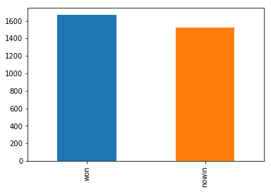

# Aprendizagem de Máquina - Relatório 1


## Questão 1


### Objetivos

Nesta questão, o objetivo é desenvolver um algoritmo que implemente o classificador k-NN com peso e sem peso. Logo após, o desempenho do classificador é avaliado utilizando dois datasets com atributos numéricos, onde será mostrado o comportamento para diferentes valores de k.

### Metodologia

Para a avaliação do algoritmo proposto pela questão, foram utilizados duas bases de dados obtidas no Promise Repository (http://promise.site.uottawa.ca/SERepository/datasets-page.html). O primeiro deles foi o "KC2/Software defect prediction" e o segundo foi o "JM1/Software defect prediction".
As duas bases de dados estavam contidas cada uma em um arquivo ARFF (Atribute-Relation File Format), onde cada linha representa uma instância e as colunas representam os atributos juntamente com as classes.
Para a leitura deste formato de arquivo foi utilizado o método arff da biblioteca Scipy para Python assim como a biblioteca Pandas que é voltada para a análise de dados. A biblioteca Matplotlib também foi utilizada para gerar os gráficos utilizados na análise.


```python
%matplotlib inline

from src.knn import *
import datetime
from scipy.io import arff
import matplotlib.pyplot as plt
import datetime

time = []
```

Abaixo segue um resumo da primeira base de dados:


```python
data_1 = arff.loadarff('datasets/kc2.arff')
df_1 = pd.DataFrame(data_1[0])
print("KC2/Software defect prediction")
df_1.head()
```

    KC2/Software defect prediction


<div>
<style scoped>
    .dataframe tbody tr th:only-of-type {
        vertical-align: middle;
    }

    .dataframe tbody tr th {
        vertical-align: top;
    }

    .dataframe thead th {
        text-align: right;
    }
</style>
<table border="1" class="dataframe">
  <thead>
    <tr style="text-align: right;">
      <th></th>
      <th>loc</th>
      <th>v(g)</th>
      <th>ev(g)</th>
      <th>iv(g)</th>
      <th>n</th>
      <th>v</th>
      <th>l</th>
      <th>d</th>
      <th>i</th>
      <th>e</th>
      <th>...</th>
      <th>lOCode</th>
      <th>lOComment</th>
      <th>lOBlank</th>
      <th>lOCodeAndComment</th>
      <th>uniq_Op</th>
      <th>uniq_Opnd</th>
      <th>total_Op</th>
      <th>total_Opnd</th>
      <th>branchCount</th>
      <th>problems</th>
    </tr>
  </thead>
  <tbody>
    <tr>
      <th>0</th>
      <td>1.1</td>
      <td>1.4</td>
      <td>1.4</td>
      <td>1.4</td>
      <td>1.3</td>
      <td>1.30</td>
      <td>1.30</td>
      <td>1.30</td>
      <td>1.30</td>
      <td>1.30</td>
      <td>...</td>
      <td>2.0</td>
      <td>2.0</td>
      <td>2.0</td>
      <td>2.0</td>
      <td>1.2</td>
      <td>1.2</td>
      <td>1.2</td>
      <td>1.2</td>
      <td>1.4</td>
      <td>b'no'</td>
    </tr>
    <tr>
      <th>1</th>
      <td>1.0</td>
      <td>1.0</td>
      <td>1.0</td>
      <td>1.0</td>
      <td>1.0</td>
      <td>1.00</td>
      <td>1.00</td>
      <td>1.00</td>
      <td>1.00</td>
      <td>1.00</td>
      <td>...</td>
      <td>1.0</td>
      <td>1.0</td>
      <td>1.0</td>
      <td>1.0</td>
      <td>1.0</td>
      <td>1.0</td>
      <td>1.0</td>
      <td>1.0</td>
      <td>1.0</td>
      <td>b'yes'</td>
    </tr>
    <tr>
      <th>2</th>
      <td>415.0</td>
      <td>59.0</td>
      <td>50.0</td>
      <td>51.0</td>
      <td>1159.0</td>
      <td>8411.31</td>
      <td>0.01</td>
      <td>103.53</td>
      <td>81.24</td>
      <td>870848.58</td>
      <td>...</td>
      <td>359.0</td>
      <td>35.0</td>
      <td>9.0</td>
      <td>10.0</td>
      <td>47.0</td>
      <td>106.0</td>
      <td>692.0</td>
      <td>467.0</td>
      <td>106.0</td>
      <td>b'yes'</td>
    </tr>
    <tr>
      <th>3</th>
      <td>230.0</td>
      <td>33.0</td>
      <td>10.0</td>
      <td>16.0</td>
      <td>575.0</td>
      <td>3732.82</td>
      <td>0.03</td>
      <td>39.82</td>
      <td>93.74</td>
      <td>148644.06</td>
      <td>...</td>
      <td>174.0</td>
      <td>15.0</td>
      <td>34.0</td>
      <td>5.0</td>
      <td>23.0</td>
      <td>67.0</td>
      <td>343.0</td>
      <td>232.0</td>
      <td>65.0</td>
      <td>b'yes'</td>
    </tr>
    <tr>
      <th>4</th>
      <td>175.0</td>
      <td>26.0</td>
      <td>12.0</td>
      <td>13.0</td>
      <td>500.0</td>
      <td>3123.96</td>
      <td>0.03</td>
      <td>29.48</td>
      <td>105.96</td>
      <td>92103.07</td>
      <td>...</td>
      <td>142.0</td>
      <td>7.0</td>
      <td>19.0</td>
      <td>4.0</td>
      <td>18.0</td>
      <td>58.0</td>
      <td>310.0</td>
      <td>190.0</td>
      <td>51.0</td>
      <td>b'yes'</td>
    </tr>
  </tbody>
</table>
<p>5 rows × 22 columns</p>
</div>


```python
df_1.describe()
```


<div>
<style scoped>
    .dataframe tbody tr th:only-of-type {
        vertical-align: middle;
    }

    .dataframe tbody tr th {
        vertical-align: top;
    }

    .dataframe thead th {
        text-align: right;
    }
</style>
<table border="1" class="dataframe">
  <thead>
    <tr style="text-align: right;">
      <th></th>
      <th>loc</th>
      <th>v(g)</th>
      <th>ev(g)</th>
      <th>iv(g)</th>
      <th>n</th>
      <th>v</th>
      <th>l</th>
      <th>d</th>
      <th>i</th>
      <th>e</th>
      <th>...</th>
      <th>t</th>
      <th>lOCode</th>
      <th>lOComment</th>
      <th>lOBlank</th>
      <th>lOCodeAndComment</th>
      <th>uniq_Op</th>
      <th>uniq_Opnd</th>
      <th>total_Op</th>
      <th>total_Opnd</th>
      <th>branchCount</th>
    </tr>
  </thead>
  <tbody>
    <tr>
      <th>count</th>
      <td>522.000000</td>
      <td>522.000000</td>
      <td>522.000000</td>
      <td>522.000000</td>
      <td>522.000000</td>
      <td>522.000000</td>
      <td>522.000000</td>
      <td>522.000000</td>
      <td>522.000000</td>
      <td>5.220000e+02</td>
      <td>...</td>
      <td>522.000000</td>
      <td>522.000000</td>
      <td>522.000000</td>
      <td>522.000000</td>
      <td>522.000000</td>
      <td>522.000000</td>
      <td>522.000000</td>
      <td>522.000000</td>
      <td>522.000000</td>
      <td>522.000000</td>
    </tr>
    <tr>
      <th>mean</th>
      <td>36.894828</td>
      <td>4.893487</td>
      <td>2.447126</td>
      <td>3.650192</td>
      <td>94.630843</td>
      <td>555.472644</td>
      <td>0.274464</td>
      <td>9.735287</td>
      <td>28.320441</td>
      <td>1.854299e+04</td>
      <td>...</td>
      <td>1094.811456</td>
      <td>27.772031</td>
      <td>2.000000</td>
      <td>4.339080</td>
      <td>0.281609</td>
      <td>9.197701</td>
      <td>14.465900</td>
      <td>57.611494</td>
      <td>37.023372</td>
      <td>8.765134</td>
    </tr>
    <tr>
      <th>std</th>
      <td>77.944048</td>
      <td>10.976772</td>
      <td>6.665003</td>
      <td>8.054860</td>
      <td>233.230165</td>
      <td>1817.468320</td>
      <td>0.275609</td>
      <td>11.088640</td>
      <td>32.225597</td>
      <td>1.132712e+05</td>
      <td>...</td>
      <td>7556.521581</td>
      <td>64.431485</td>
      <td>5.582052</td>
      <td>9.214753</td>
      <td>1.038236</td>
      <td>6.360180</td>
      <td>22.086661</td>
      <td>142.990741</td>
      <td>90.398620</td>
      <td>21.942779</td>
    </tr>
    <tr>
      <th>min</th>
      <td>1.000000</td>
      <td>1.000000</td>
      <td>1.000000</td>
      <td>1.000000</td>
      <td>1.000000</td>
      <td>0.000000</td>
      <td>0.000000</td>
      <td>0.000000</td>
      <td>0.000000</td>
      <td>0.000000e+00</td>
      <td>...</td>
      <td>0.000000</td>
      <td>0.000000</td>
      <td>0.000000</td>
      <td>0.000000</td>
      <td>0.000000</td>
      <td>1.000000</td>
      <td>0.000000</td>
      <td>1.000000</td>
      <td>0.000000</td>
      <td>1.000000</td>
    </tr>
    <tr>
      <th>25%</th>
      <td>4.000000</td>
      <td>1.000000</td>
      <td>1.000000</td>
      <td>1.000000</td>
      <td>5.000000</td>
      <td>11.610000</td>
      <td>0.060000</td>
      <td>1.500000</td>
      <td>7.740000</td>
      <td>1.741000e+01</td>
      <td>...</td>
      <td>0.970000</td>
      <td>2.000000</td>
      <td>0.000000</td>
      <td>0.000000</td>
      <td>0.000000</td>
      <td>3.000000</td>
      <td>2.000000</td>
      <td>4.000000</td>
      <td>2.000000</td>
      <td>1.000000</td>
    </tr>
    <tr>
      <th>50%</th>
      <td>13.000000</td>
      <td>2.000000</td>
      <td>1.000000</td>
      <td>2.000000</td>
      <td>27.000000</td>
      <td>109.205000</td>
      <td>0.140000</td>
      <td>6.000000</td>
      <td>20.560000</td>
      <td>6.135900e+02</td>
      <td>...</td>
      <td>34.090000</td>
      <td>8.000000</td>
      <td>0.000000</td>
      <td>1.000000</td>
      <td>0.000000</td>
      <td>8.000000</td>
      <td>7.000000</td>
      <td>16.500000</td>
      <td>11.000000</td>
      <td>3.000000</td>
    </tr>
    <tr>
      <th>75%</th>
      <td>45.000000</td>
      <td>5.000000</td>
      <td>1.000000</td>
      <td>4.000000</td>
      <td>104.750000</td>
      <td>543.787500</td>
      <td>0.500000</td>
      <td>14.610000</td>
      <td>38.365000</td>
      <td>7.624085e+03</td>
      <td>...</td>
      <td>423.562500</td>
      <td>33.750000</td>
      <td>2.000000</td>
      <td>5.000000</td>
      <td>0.000000</td>
      <td>14.000000</td>
      <td>20.000000</td>
      <td>64.000000</td>
      <td>41.000000</td>
      <td>9.000000</td>
    </tr>
    <tr>
      <th>max</th>
      <td>1275.000000</td>
      <td>180.000000</td>
      <td>125.000000</td>
      <td>143.000000</td>
      <td>3982.000000</td>
      <td>33814.560000</td>
      <td>2.000000</td>
      <td>103.530000</td>
      <td>415.060000</td>
      <td>2.147484e+06</td>
      <td>...</td>
      <td>153047.010000</td>
      <td>1107.000000</td>
      <td>44.000000</td>
      <td>121.000000</td>
      <td>11.000000</td>
      <td>47.000000</td>
      <td>325.000000</td>
      <td>2469.000000</td>
      <td>1513.000000</td>
      <td>361.000000</td>
    </tr>
  </tbody>
</table>
<p>8 rows × 21 columns</p>
</div>


Podemos notar um desbalanceamento das classes no gráfico exibido abaixo:


```python
df_1['problems'].value_counts().plot(kind='bar')
```


    <matplotlib.axes._subplots.AxesSubplot at 0x7fbfd59e7e80>


Agora analisando a segunda base de dados, temos:


```python
data_2 = arff.loadarff('datasets/jm1.arff')
df_2 = pd.DataFrame(data_2[0])
print("JM1/Software defect prediction")
df_2.head()
```

    JM1/Software defect prediction


<div>
<style scoped>
    .dataframe tbody tr th:only-of-type {
        vertical-align: middle;
    }

    .dataframe tbody tr th {
        vertical-align: top;
    }

    .dataframe thead th {
        text-align: right;
    }
</style>
<table border="1" class="dataframe">
  <thead>
    <tr style="text-align: right;">
      <th></th>
      <th>loc</th>
      <th>v(g)</th>
      <th>ev(g)</th>
      <th>iv(g)</th>
      <th>n</th>
      <th>...</th>
      <th>uniq_Opnd</th>
      <th>total_Op</th>
      <th>total_Opnd</th>
      <th>branchCount</th>
      <th>defects</th>
    </tr>
  </thead>
  <tbody>
    <tr>
      <th>0</th>
      <td>1.1</td>
      <td>1.4</td>
      <td>1.4</td>
      <td>1.4</td>
      <td>1.3</td>
      <td>...</td>
      <td>1.2</td>
      <td>1.2</td>
      <td>1.2</td>
      <td>1.4</td>
      <td>b'false'</td>
    </tr>
    <tr>
      <th>1</th>
      <td>1.0</td>
      <td>1.0</td>
      <td>1.0</td>
      <td>1.0</td>
      <td>1.0</td>
      <td>...</td>
      <td>1.0</td>
      <td>1.0</td>
      <td>1.0</td>
      <td>1.0</td>
      <td>b'true'</td>
    </tr>
    <tr>
      <th>2</th>
      <td>72.0</td>
      <td>7.0</td>
      <td>1.0</td>
      <td>6.0</td>
      <td>198.0</td>
      <td>...</td>
      <td>36.0</td>
      <td>112.0</td>
      <td>86.0</td>
      <td>13.0</td>
      <td>b'true'</td>
    </tr>
    <tr>
      <th>3</th>
      <td>190.0</td>
      <td>3.0</td>
      <td>1.0</td>
      <td>3.0</td>
      <td>600.0</td>
      <td>...</td>
      <td>135.0</td>
      <td>329.0</td>
      <td>271.0</td>
      <td>5.0</td>
      <td>b'true'</td>
    </tr>
    <tr>
      <th>4</th>
      <td>37.0</td>
      <td>4.0</td>
      <td>1.0</td>
      <td>4.0</td>
      <td>126.0</td>
      <td>...</td>
      <td>16.0</td>
      <td>76.0</td>
      <td>50.0</td>
      <td>7.0</td>
      <td>b'true'</td>
    </tr>
  </tbody>
</table>
<p>5 rows × 22 columns</p>
</div>


```python
df_2.describe()
```


<div>
<style scoped>
    .dataframe tbody tr th:only-of-type {
        vertical-align: middle;
    }

    .dataframe tbody tr th {
        vertical-align: top;
    }

    .dataframe thead th {
        text-align: right;
    }
</style>
<table border="1" class="dataframe">
  <thead>
    <tr style="text-align: right;">
      <th></th>
      <th>loc</th>
      <th>v(g)</th>
      <th>ev(g)</th>
      <th>iv(g)</th>
      <th>n</th>
      <th>v</th>
      <th>l</th>
      <th>d</th>
      <th>i</th>
      <th>e</th>
      <th>...</th>
      <th>t</th>
      <th>lOCode</th>
      <th>lOComment</th>
      <th>lOBlank</th>
      <th>locCodeAndComment</th>
      <th>uniq_Op</th>
      <th>uniq_Opnd</th>
      <th>total_Op</th>
      <th>total_Opnd</th>
      <th>branchCount</th>
    </tr>
  </thead>
  <tbody>
    <tr>
      <th>count</th>
      <td>10885.000000</td>
      <td>10885.000000</td>
      <td>10885.000000</td>
      <td>10885.000000</td>
      <td>10885.000000</td>
      <td>10885.000000</td>
      <td>10885.000000</td>
      <td>10885.000000</td>
      <td>10885.000000</td>
      <td>1.088500e+04</td>
      <td>...</td>
      <td>1.088500e+04</td>
      <td>10885.000000</td>
      <td>10885.000000</td>
      <td>10885.00000</td>
      <td>10885.000000</td>
      <td>10880.000000</td>
      <td>10880.000000</td>
      <td>10880.000000</td>
      <td>10880.000000</td>
      <td>10880.000000</td>
    </tr>
    <tr>
      <th>mean</th>
      <td>42.016178</td>
      <td>6.348590</td>
      <td>3.401047</td>
      <td>4.001599</td>
      <td>114.389738</td>
      <td>673.758017</td>
      <td>0.135335</td>
      <td>14.177237</td>
      <td>29.439544</td>
      <td>3.683637e+04</td>
      <td>...</td>
      <td>2.046465e+03</td>
      <td>26.252274</td>
      <td>2.737529</td>
      <td>4.62554</td>
      <td>0.370785</td>
      <td>11.177592</td>
      <td>16.751857</td>
      <td>68.110588</td>
      <td>46.388989</td>
      <td>11.292316</td>
    </tr>
    <tr>
      <th>std</th>
      <td>76.593332</td>
      <td>13.019695</td>
      <td>6.771869</td>
      <td>9.116889</td>
      <td>249.502091</td>
      <td>1938.856196</td>
      <td>0.160538</td>
      <td>18.709900</td>
      <td>34.418313</td>
      <td>4.343678e+05</td>
      <td>...</td>
      <td>2.413154e+04</td>
      <td>59.611201</td>
      <td>9.008608</td>
      <td>9.96813</td>
      <td>1.907969</td>
      <td>10.045255</td>
      <td>26.667883</td>
      <td>151.513836</td>
      <td>100.351845</td>
      <td>22.597617</td>
    </tr>
    <tr>
      <th>min</th>
      <td>1.000000</td>
      <td>1.000000</td>
      <td>1.000000</td>
      <td>1.000000</td>
      <td>0.000000</td>
      <td>0.000000</td>
      <td>0.000000</td>
      <td>0.000000</td>
      <td>0.000000</td>
      <td>0.000000e+00</td>
      <td>...</td>
      <td>0.000000e+00</td>
      <td>0.000000</td>
      <td>0.000000</td>
      <td>0.00000</td>
      <td>0.000000</td>
      <td>0.000000</td>
      <td>0.000000</td>
      <td>0.000000</td>
      <td>0.000000</td>
      <td>1.000000</td>
    </tr>
    <tr>
      <th>25%</th>
      <td>11.000000</td>
      <td>2.000000</td>
      <td>1.000000</td>
      <td>1.000000</td>
      <td>14.000000</td>
      <td>48.430000</td>
      <td>0.030000</td>
      <td>3.000000</td>
      <td>11.860000</td>
      <td>1.619400e+02</td>
      <td>...</td>
      <td>9.000000e+00</td>
      <td>4.000000</td>
      <td>0.000000</td>
      <td>0.00000</td>
      <td>0.000000</td>
      <td>5.000000</td>
      <td>4.000000</td>
      <td>8.000000</td>
      <td>6.000000</td>
      <td>3.000000</td>
    </tr>
    <tr>
      <th>50%</th>
      <td>23.000000</td>
      <td>3.000000</td>
      <td>1.000000</td>
      <td>2.000000</td>
      <td>49.000000</td>
      <td>217.130000</td>
      <td>0.080000</td>
      <td>9.090000</td>
      <td>21.930000</td>
      <td>2.031020e+03</td>
      <td>...</td>
      <td>1.128300e+02</td>
      <td>13.000000</td>
      <td>0.000000</td>
      <td>2.00000</td>
      <td>0.000000</td>
      <td>11.000000</td>
      <td>11.000000</td>
      <td>29.000000</td>
      <td>19.000000</td>
      <td>5.000000</td>
    </tr>
    <tr>
      <th>75%</th>
      <td>46.000000</td>
      <td>7.000000</td>
      <td>3.000000</td>
      <td>4.000000</td>
      <td>119.000000</td>
      <td>621.480000</td>
      <td>0.160000</td>
      <td>18.900000</td>
      <td>36.780000</td>
      <td>1.141643e+04</td>
      <td>...</td>
      <td>6.342500e+02</td>
      <td>28.000000</td>
      <td>2.000000</td>
      <td>5.00000</td>
      <td>0.000000</td>
      <td>16.000000</td>
      <td>21.000000</td>
      <td>71.000000</td>
      <td>48.000000</td>
      <td>13.000000</td>
    </tr>
    <tr>
      <th>max</th>
      <td>3442.000000</td>
      <td>470.000000</td>
      <td>165.000000</td>
      <td>402.000000</td>
      <td>8441.000000</td>
      <td>80843.080000</td>
      <td>1.300000</td>
      <td>418.200000</td>
      <td>569.780000</td>
      <td>3.107978e+07</td>
      <td>...</td>
      <td>1.726655e+06</td>
      <td>2824.000000</td>
      <td>344.000000</td>
      <td>447.00000</td>
      <td>108.000000</td>
      <td>411.000000</td>
      <td>1026.000000</td>
      <td>5420.000000</td>
      <td>3021.000000</td>
      <td>826.000000</td>
    </tr>
  </tbody>
</table>
<p>8 rows × 21 columns</p>
</div>


Assim como a primeira base de dados, podemos observar aqui também uma desproporção entre as classes do problema:


```python
df_2['defects'].value_counts().plot(kind='bar')
```


    <matplotlib.axes._subplots.AxesSubplot at 0x7fbfd35597f0>


O algoritmo do k-NN foi implementado também em Python e se encontra do diretório "src/". Neste diretório encontram-se dois arquivos: distances.py e knn.py, onde o primeiro implementa as distâncias utilizadas nesta e nas próximas questões e o último é a implementação do classificador k-NN.

### Resultados

Para a avaliação dos classificadores k-NN com e sem peso, cada base de dados foi submetida ao k-fold cross validation, onde o valor escolhido para k foi 10. Cada classificador executou para os números de vizinhos k = {1,2,3,5,7,9,11,13,15}.
As acurácias obtidas utilizando a primeira base de dados seguem abaixo:


```python
n_fold = 10
k_values = [1,2,3,5,7,9,11,13,15]

data_1 = df_1.values
np.random.shuffle(data_1)

mod = data_1.shape[0] % n_fold
data_1 = data_1[mod:]

accs = []
weighted_accs = []

print("---------------------KNN---------------------")
cur = datetime.datetime.now()
accs = cross_validation(data_1, n_fold, k_values)
time.append(datetime.datetime.now() - cur)
for i in range(len(k_values)):
    print("The accuracy for k = {:d} is: {:.2f}%".format(k_values[i], accs[i]))

print("\n---------------------WEIGHTED KNN---------------------")
cur = datetime.datetime.now()
weighted_accs = cross_validation(data_1, n_fold, k_values, with_weight=True)
time.append(datetime.datetime.now() - cur)
for i in range(len(k_values)):
    print("The accuracy for k = {:d} is: {:.2f}%".format(k_values[i], weighted_accs[i]))
```

    ---------------------KNN---------------------
    The accuracy for k = 1 is: 75.19%
    The accuracy for k = 2 is: 80.19%
    The accuracy for k = 3 is: 80.19%
    The accuracy for k = 5 is: 81.73%
    The accuracy for k = 7 is: 81.92%
    The accuracy for k = 9 is: 82.31%
    The accuracy for k = 11 is: 82.31%
    The accuracy for k = 13 is: 81.92%
    The accuracy for k = 15 is: 81.92%
    
    ---------------------WEIGHTED KNN---------------------
    The accuracy for k = 1 is: 75.19%
    The accuracy for k = 2 is: 77.50%
    The accuracy for k = 3 is: 78.27%
    The accuracy for k = 5 is: 79.62%
    The accuracy for k = 7 is: 80.00%
    The accuracy for k = 9 is: 80.38%
    The accuracy for k = 11 is: 80.58%
    The accuracy for k = 13 is: 81.15%
    The accuracy for k = 15 is: 81.15%


A comparação dos dois classificadores variando o número de vizinhos pode ser visualizada no gráfico abaixo:


```python
fig, ax = plt.subplots()

index = np.arange(len(k_values))
bar_width = 0.35
opacity = 0.4

rects1 = ax.bar(index, accs, bar_width,
                alpha=opacity, color='b',
                label='k-NN')

rects2 = ax.bar(index + bar_width, weighted_accs,
                bar_width, color='r',
                alpha=opacity, label='Weighted k-NN')

ax.set_xlabel('k Neighbors')
ax.set_ylabel('Accuracy (%)')
ax.set_title('k-NN Performance')
ax.set_xticks(index + bar_width / 2)
ax.set_xticklabels(('1', '2', '3', '5', '7', '9', '11', '13', '15'))
ax.legend()

fig.tight_layout()
plt.show()
```


Agora avaliando a segunda base de dados:


```python
n_fold = 10
k_values = [1,2,3,5,7,9,11,13,15]

data_2 = df_2.values
np.random.shuffle(data_2)

mod = data_2.shape[0] % n_fold
data_2 = data_2[mod:]

accs = []
weighted_accs = []

print("---------------------KNN---------------------")
cur = datetime.datetime.now()
accs = cross_validation(data_2, n_fold, k_values)
time.append(datetime.datetime.now() - cur)
for i in range(len(k_values)):
    print("The accuracy for k = {:d} is: {:.2f}%".format(k_values[i], accs[i]))

print("\n---------------------WEIGHTED KNN---------------------")
cur = datetime.datetime.now()
weighted_accs = cross_validation(data_2, n_fold, k_values, with_weight=True)
time.append(datetime.datetime.now() - cur)
for i in range(len(k_values)):
    print("The accuracy for k = {:d} is: {:.2f}%".format(k_values[i], weighted_accs[i]))
```

## Questão 2


### Objetivos

Nesta questão, o objetivo é desenvolver um algoritmo que implemente o classificador k-NN com peso e sem peso utilizando a distância VDM . Logo após, o desempenho do classificador é avaliado utilizando dois datasets com atributos categóricos, onde será mostrado o comportamento para diferentes valores de k.

### Metodologia

Para a avaliação do algoritmo proposto pela questão, foram utilizados duas bases de dados obtidas no UCI Machine Learning Repository (https://archive.ics.uci.edu/ml/datasets.html). O primeiro deles foi o "Chess (King-Rook vs. King-Pawn)" e o segundo foi o "Tic-Tac-Toe Endgame Data Set".
As duas bases de dados estavam contidas cada uma em um arquivo .DATA, onde cada linha representa uma instância e as colunas representam os atributos juntamente com as classes.
Para a leitura deste formato de arquivo foi utilizado a biblioteca Pandas. A biblioteca Matplotlib também foi utilizada para gerar os gráficos utilizados na análise.
Abaixo segue um resumo da primeira base de dados:


```python
df_1 = pd.read_csv('datasets/chess.data')
pd.set_option('display.max_columns', df.shape[1])
df_1.head()
```


<div>
<style scoped>
    .dataframe tbody tr th:only-of-type {
        vertical-align: middle;
    }

    .dataframe tbody tr th {
        vertical-align: top;
    }

    .dataframe thead th {
        text-align: right;
    }
</style>
<table border="1" class="dataframe">
  <thead>
    <tr style="text-align: right;">
      <th></th>
      <th>P1</th>
      <th>P2</th>
      <th>P3</th>
      <th>P4</th>
      <th>P5</th>
      <th>P6</th>
      <th>P7</th>
      <th>P8</th>
      <th>P9</th>
      <th>P10</th>
      <th>P11</th>
      <th>P12</th>
      <th>P13</th>
      <th>P14</th>
      <th>P15</th>
      <th>P16</th>
      <th>P17</th>
      <th>P18</th>
      <th>P19</th>
      <th>P20</th>
      <th>P21</th>
      <th>P22</th>
      <th>P23</th>
      <th>P24</th>
      <th>P25</th>
      <th>P26</th>
      <th>P27</th>
      <th>P28</th>
      <th>P29</th>
      <th>P30</th>
      <th>P31</th>
      <th>P32</th>
      <th>P33</th>
      <th>P34</th>
      <th>P35</th>
      <th>P36</th>
      <th>C</th>
    </tr>
  </thead>
  <tbody>
    <tr>
      <th>0</th>
      <td>f</td>
      <td>f</td>
      <td>f</td>
      <td>f</td>
      <td>f</td>
      <td>f</td>
      <td>f</td>
      <td>f</td>
      <td>f</td>
      <td>f</td>
      <td>f</td>
      <td>f</td>
      <td>l</td>
      <td>f</td>
      <td>n</td>
      <td>f</td>
      <td>f</td>
      <td>t</td>
      <td>f</td>
      <td>f</td>
      <td>f</td>
      <td>f</td>
      <td>f</td>
      <td>f</td>
      <td>f</td>
      <td>t</td>
      <td>f</td>
      <td>f</td>
      <td>f</td>
      <td>f</td>
      <td>f</td>
      <td>f</td>
      <td>f</td>
      <td>t</td>
      <td>t</td>
      <td>n</td>
      <td>won</td>
    </tr>
    <tr>
      <th>1</th>
      <td>f</td>
      <td>f</td>
      <td>f</td>
      <td>f</td>
      <td>t</td>
      <td>f</td>
      <td>f</td>
      <td>f</td>
      <td>f</td>
      <td>f</td>
      <td>f</td>
      <td>f</td>
      <td>l</td>
      <td>f</td>
      <td>n</td>
      <td>f</td>
      <td>f</td>
      <td>t</td>
      <td>f</td>
      <td>f</td>
      <td>f</td>
      <td>f</td>
      <td>f</td>
      <td>f</td>
      <td>f</td>
      <td>t</td>
      <td>f</td>
      <td>f</td>
      <td>f</td>
      <td>f</td>
      <td>f</td>
      <td>f</td>
      <td>f</td>
      <td>t</td>
      <td>t</td>
      <td>n</td>
      <td>won</td>
    </tr>
    <tr>
      <th>2</th>
      <td>f</td>
      <td>f</td>
      <td>f</td>
      <td>f</td>
      <td>t</td>
      <td>f</td>
      <td>t</td>
      <td>f</td>
      <td>f</td>
      <td>f</td>
      <td>f</td>
      <td>f</td>
      <td>l</td>
      <td>f</td>
      <td>n</td>
      <td>f</td>
      <td>f</td>
      <td>t</td>
      <td>f</td>
      <td>f</td>
      <td>f</td>
      <td>f</td>
      <td>f</td>
      <td>f</td>
      <td>f</td>
      <td>t</td>
      <td>f</td>
      <td>f</td>
      <td>f</td>
      <td>f</td>
      <td>f</td>
      <td>f</td>
      <td>f</td>
      <td>t</td>
      <td>t</td>
      <td>n</td>
      <td>won</td>
    </tr>
    <tr>
      <th>3</th>
      <td>f</td>
      <td>f</td>
      <td>f</td>
      <td>f</td>
      <td>f</td>
      <td>f</td>
      <td>f</td>
      <td>f</td>
      <td>t</td>
      <td>f</td>
      <td>f</td>
      <td>f</td>
      <td>l</td>
      <td>f</td>
      <td>n</td>
      <td>f</td>
      <td>f</td>
      <td>t</td>
      <td>f</td>
      <td>f</td>
      <td>f</td>
      <td>t</td>
      <td>f</td>
      <td>f</td>
      <td>f</td>
      <td>t</td>
      <td>f</td>
      <td>f</td>
      <td>f</td>
      <td>f</td>
      <td>f</td>
      <td>f</td>
      <td>f</td>
      <td>t</td>
      <td>t</td>
      <td>n</td>
      <td>won</td>
    </tr>
    <tr>
      <th>4</th>
      <td>f</td>
      <td>f</td>
      <td>f</td>
      <td>f</td>
      <td>f</td>
      <td>f</td>
      <td>f</td>
      <td>f</td>
      <td>f</td>
      <td>f</td>
      <td>f</td>
      <td>f</td>
      <td>l</td>
      <td>f</td>
      <td>n</td>
      <td>f</td>
      <td>f</td>
      <td>t</td>
      <td>f</td>
      <td>f</td>
      <td>f</td>
      <td>f</td>
      <td>f</td>
      <td>t</td>
      <td>f</td>
      <td>t</td>
      <td>f</td>
      <td>f</td>
      <td>f</td>
      <td>f</td>
      <td>f</td>
      <td>f</td>
      <td>f</td>
      <td>t</td>
      <td>t</td>
      <td>n</td>
      <td>won</td>
    </tr>
  </tbody>
</table>
</div>


```python
df_1.describe()
```


<div>
<style scoped>
    .dataframe tbody tr th:only-of-type {
        vertical-align: middle;
    }

    .dataframe tbody tr th {
        vertical-align: top;
    }

    .dataframe thead th {
        text-align: right;
    }
</style>
<table border="1" class="dataframe">
  <thead>
    <tr style="text-align: right;">
      <th></th>
      <th>P1</th>
      <th>P2</th>
      <th>P3</th>
      <th>P4</th>
      <th>P5</th>
      <th>P6</th>
      <th>P7</th>
      <th>P8</th>
      <th>P9</th>
      <th>P10</th>
      <th>P11</th>
      <th>P12</th>
      <th>P13</th>
      <th>P14</th>
      <th>P15</th>
      <th>P16</th>
      <th>P17</th>
      <th>P18</th>
      <th>P19</th>
      <th>P20</th>
      <th>P21</th>
      <th>P22</th>
      <th>P23</th>
      <th>P24</th>
      <th>P25</th>
      <th>P26</th>
      <th>P27</th>
      <th>P28</th>
      <th>P29</th>
      <th>P30</th>
      <th>P31</th>
      <th>P32</th>
      <th>P33</th>
      <th>P34</th>
      <th>P35</th>
      <th>P36</th>
      <th>C</th>
    </tr>
  </thead>
  <tbody>
    <tr>
      <th>count</th>
      <td>3196</td>
      <td>3196</td>
      <td>3196</td>
      <td>3196</td>
      <td>3196</td>
      <td>3196</td>
      <td>3196</td>
      <td>3196</td>
      <td>3196</td>
      <td>3196</td>
      <td>3196</td>
      <td>3196</td>
      <td>3196</td>
      <td>3196</td>
      <td>3196</td>
      <td>3196</td>
      <td>3196</td>
      <td>3196</td>
      <td>3196</td>
      <td>3196</td>
      <td>3196</td>
      <td>3196</td>
      <td>3196</td>
      <td>3196</td>
      <td>3196</td>
      <td>3196</td>
      <td>3196</td>
      <td>3196</td>
      <td>3196</td>
      <td>3196</td>
      <td>3196</td>
      <td>3196</td>
      <td>3196</td>
      <td>3196</td>
      <td>3196</td>
      <td>3196</td>
      <td>3196</td>
    </tr>
    <tr>
      <th>unique</th>
      <td>2</td>
      <td>2</td>
      <td>2</td>
      <td>2</td>
      <td>2</td>
      <td>2</td>
      <td>2</td>
      <td>2</td>
      <td>2</td>
      <td>2</td>
      <td>2</td>
      <td>2</td>
      <td>2</td>
      <td>2</td>
      <td>3</td>
      <td>2</td>
      <td>2</td>
      <td>2</td>
      <td>2</td>
      <td>2</td>
      <td>2</td>
      <td>2</td>
      <td>2</td>
      <td>2</td>
      <td>2</td>
      <td>2</td>
      <td>2</td>
      <td>2</td>
      <td>2</td>
      <td>2</td>
      <td>2</td>
      <td>2</td>
      <td>2</td>
      <td>2</td>
      <td>2</td>
      <td>2</td>
      <td>2</td>
    </tr>
    <tr>
      <th>top</th>
      <td>f</td>
      <td>f</td>
      <td>f</td>
      <td>f</td>
      <td>f</td>
      <td>f</td>
      <td>f</td>
      <td>f</td>
      <td>f</td>
      <td>f</td>
      <td>f</td>
      <td>f</td>
      <td>l</td>
      <td>f</td>
      <td>n</td>
      <td>f</td>
      <td>f</td>
      <td>t</td>
      <td>f</td>
      <td>f</td>
      <td>f</td>
      <td>f</td>
      <td>f</td>
      <td>f</td>
      <td>f</td>
      <td>t</td>
      <td>f</td>
      <td>f</td>
      <td>f</td>
      <td>f</td>
      <td>f</td>
      <td>f</td>
      <td>f</td>
      <td>t</td>
      <td>t</td>
      <td>n</td>
      <td>won</td>
    </tr>
    <tr>
      <th>freq</th>
      <td>2839</td>
      <td>2971</td>
      <td>3076</td>
      <td>2874</td>
      <td>2129</td>
      <td>1722</td>
      <td>2026</td>
      <td>2500</td>
      <td>1980</td>
      <td>2225</td>
      <td>1817</td>
      <td>2860</td>
      <td>2205</td>
      <td>3181</td>
      <td>2526</td>
      <td>3040</td>
      <td>3099</td>
      <td>2196</td>
      <td>3170</td>
      <td>2714</td>
      <td>2612</td>
      <td>2556</td>
      <td>3013</td>
      <td>1975</td>
      <td>3185</td>
      <td>2216</td>
      <td>3021</td>
      <td>3195</td>
      <td>3149</td>
      <td>3060</td>
      <td>2631</td>
      <td>3021</td>
      <td>1984</td>
      <td>2007</td>
      <td>2345</td>
      <td>2407</td>
      <td>1669</td>
    </tr>
  </tbody>
</table>
</div>


Podemos notar que as classes estão bem distribuídas através do gráfico abaixo:


```python
df_1['C'].value_counts().plot(kind='bar')
```


    <matplotlib.axes._subplots.AxesSubplot at 0x7fbfd31dc9b0>





Agora analisando a segunda base de dados, temos:


```python
df_2 = pd.read_csv('datasets/tic-tac-toe.data')
pd.set_option('display.max_columns', df_2.shape[1])
df_2.head()
```


<div>
<style scoped>
    .dataframe tbody tr th:only-of-type {
        vertical-align: middle;
    }

    .dataframe tbody tr th {
        vertical-align: top;
    }

    .dataframe thead th {
        text-align: right;
    }
</style>
<table border="1" class="dataframe">
  <thead>
    <tr style="text-align: right;">
      <th></th>
      <th>P1</th>
      <th>P2</th>
      <th>P3</th>
      <th>P4</th>
      <th>P5</th>
      <th>P6</th>
      <th>P7</th>
      <th>P8</th>
      <th>P9</th>
      <th>C</th>
    </tr>
  </thead>
  <tbody>
    <tr>
      <th>0</th>
      <td>x</td>
      <td>x</td>
      <td>x</td>
      <td>x</td>
      <td>o</td>
      <td>o</td>
      <td>x</td>
      <td>o</td>
      <td>o</td>
      <td>positive</td>
    </tr>
    <tr>
      <th>1</th>
      <td>x</td>
      <td>x</td>
      <td>x</td>
      <td>x</td>
      <td>o</td>
      <td>o</td>
      <td>o</td>
      <td>x</td>
      <td>o</td>
      <td>positive</td>
    </tr>
    <tr>
      <th>2</th>
      <td>x</td>
      <td>x</td>
      <td>x</td>
      <td>x</td>
      <td>o</td>
      <td>o</td>
      <td>o</td>
      <td>o</td>
      <td>x</td>
      <td>positive</td>
    </tr>
    <tr>
      <th>3</th>
      <td>x</td>
      <td>x</td>
      <td>x</td>
      <td>x</td>
      <td>o</td>
      <td>o</td>
      <td>o</td>
      <td>b</td>
      <td>b</td>
      <td>positive</td>
    </tr>
    <tr>
      <th>4</th>
      <td>x</td>
      <td>x</td>
      <td>x</td>
      <td>x</td>
      <td>o</td>
      <td>o</td>
      <td>b</td>
      <td>o</td>
      <td>b</td>
      <td>positive</td>
    </tr>
  </tbody>
</table>
</div>


```python
df_2.describe()
```


<div>
<style scoped>
    .dataframe tbody tr th:only-of-type {
        vertical-align: middle;
    }

    .dataframe tbody tr th {
        vertical-align: top;
    }

    .dataframe thead th {
        text-align: right;
    }
</style>
<table border="1" class="dataframe">
  <thead>
    <tr style="text-align: right;">
      <th></th>
      <th>P1</th>
      <th>P2</th>
      <th>P3</th>
      <th>P4</th>
      <th>P5</th>
      <th>P6</th>
      <th>P7</th>
      <th>P8</th>
      <th>P9</th>
      <th>C</th>
    </tr>
  </thead>
  <tbody>
    <tr>
      <th>count</th>
      <td>958</td>
      <td>958</td>
      <td>958</td>
      <td>958</td>
      <td>958</td>
      <td>958</td>
      <td>958</td>
      <td>958</td>
      <td>958</td>
      <td>958</td>
    </tr>
    <tr>
      <th>unique</th>
      <td>3</td>
      <td>3</td>
      <td>3</td>
      <td>3</td>
      <td>3</td>
      <td>3</td>
      <td>3</td>
      <td>3</td>
      <td>3</td>
      <td>2</td>
    </tr>
    <tr>
      <th>top</th>
      <td>x</td>
      <td>x</td>
      <td>x</td>
      <td>x</td>
      <td>x</td>
      <td>x</td>
      <td>x</td>
      <td>x</td>
      <td>x</td>
      <td>positive</td>
    </tr>
    <tr>
      <th>freq</th>
      <td>418</td>
      <td>378</td>
      <td>418</td>
      <td>378</td>
      <td>458</td>
      <td>378</td>
      <td>418</td>
      <td>378</td>
      <td>418</td>
      <td>626</td>
    </tr>
  </tbody>
</table>
</div>


Observando o gráfico abaixo pode-se notar um certo desbalanceamento entre as classes:


```python
df_2['C'].value_counts().plot(kind='bar')
```


    <matplotlib.axes._subplots.AxesSubplot at 0x7fbfd25b5390>


### Resultados

Para a avaliação dos classificadores k-NN com e sem peso, cada base de dados foi submetida ao k-fold cross validation, onde o valor escolhido para k foi 10. Cada classificador executou para os números de vizinhos k = {1,2,3,5,7,9,11,13,15}.
As acurácias obtidas utilizando a primeira base de dados seguem abaixo:


```python
n_fold = 10
data_1 = df_1.values
np.random.shuffle(data_1)
mod = data_1.shape[0] % n_fold
data_1 = data_1[mod:]

k_values = [1,2,3,5,7,9,11,13,15]
accs = []
weighted_accs = []

print("---------------------KNN---------------------")
cur = datetime.datetime.now()
accs = cross_validation(data_1, n_fold, k_values, data_type=1, dataframe=df)
time.append(datetime.datetime.now() - cur)
for i in range(len(accs)):
    print("The accuracy for k = {:d} is: {:.2f}%".format(k_values[i], accs[i]))

print("---------------------WEIGHTED KNN---------------------")
cur = datetime.datetime.now()
accs = cross_validation(data_1, n_fold, k_values, data_type=1, dataframe=df, with_weight=True)
time.append(datetime.datetime.now() - cur)
for i in range(len(accs)):
    print("The accuracy for k = {:d} is: {:.2f}%".format(k_values[i], accs[i]))
```

    The accuracy for k = 1 is: 96.99%
    The accuracy for k = 2 is: 96.77%
    The accuracy for k = 3 is: 96.74%
    The accuracy for k = 5 is: 96.96%
    The accuracy for k = 7 is: 96.46%
    The accuracy for k = 9 is: 96.46%
    The accuracy for k = 11 is: 96.08%
    The accuracy for k = 13 is: 96.08%
    The accuracy for k = 15 is: 95.92%


Abaixo seguem os resultados para a segunda base de dados:


```python
data_2 = df_2.values
np.random.shuffle(data_2)
mod = data_2.shape[0] % n_fold
data_2 = data_2[mod:]

print("---------------------KNN---------------------")
cur = datetime.datetime.now()
accs = cross_validation(data_2, n_fold, k_values, data_type=1, dataframe=df_2)
time.append(datetime.datetime.now() - cur)
for i in range(len(accs)):
    print("The accuracy for k = {:d} is: {:.2f}%".format(k_values[i], accs[i]))

print("---------------------WEIGHTED KNN---------------------")
cur = datetime.datetime.now()
accs = cross_validation(data_2, n_fold, k_values, data_type=1, dataframe=df_2, with_weight=True)
time.append(datetime.datetime.now() - cur)
for i in range(len(accs)):
    print("The accuracy for k = {:d} is: {:.2f}%".format(k_values[i], accs[i]))
```

    ---------------------KNN---------------------
    The accuracy for k = 1 is: 93.47%
    The accuracy for k = 2 is: 91.16%
    The accuracy for k = 3 is: 90.21%
    The accuracy for k = 5 is: 93.05%
    The accuracy for k = 7 is: 90.63%
    The accuracy for k = 9 is: 91.58%
    The accuracy for k = 11 is: 90.53%
    The accuracy for k = 13 is: 89.26%
    The accuracy for k = 15 is: 90.00%
    ---------------------WEIGHTED KNN---------------------
    The accuracy for k = 1 is: 93.47%
    The accuracy for k = 2 is: 93.05%
    The accuracy for k = 3 is: 90.95%
    The accuracy for k = 5 is: 92.84%
    The accuracy for k = 7 is: 91.05%
    The accuracy for k = 9 is: 91.58%
    The accuracy for k = 11 is: 91.16%
    The accuracy for k = 13 is: 90.95%
    The accuracy for k = 15 is: 91.16%


## Questão 3


### Objetivos

Nesta questão, o objetivo é desenvolver um algoritmo que implemente o classificador k-NN com peso e sem peso utilizando a distância HVDM . Logo após, o desempenho do classificador é avaliado utilizando dois datasets com atributos numéŕicos e categóricos, onde será mostrado o comportamento para diferentes valores de k.

### Metodologia

Para a avaliação do algoritmo proposto pela questão, foram utilizados duas bases de dados obtidas no UCI Machine Learning Repository (https://archive.ics.uci.edu/ml/datasets.html). O primeiro deles foi o "Statlog (German Credit Data)" e o segundo foi o "Fulano de tal".
As duas bases de dados estavam contidas cada uma em um arquivo .DATA, onde cada linha representa uma instância e as colunas representam os atributos juntamente com as classes.
Para a leitura deste formato de arquivo foi utilizado a biblioteca Pandas. A biblioteca Matplotlib também foi utilizada para gerar os gráficos utilizados na análise.
Abaixo segue um resumo da primeira base de dados:


```python
df_1 = pd.read_csv('datasets/german_credit.data')
pd.set_option('display.max_columns', df_1.shape[1])
df_1.head()
```


<div>
<style scoped>
    .dataframe tbody tr th:only-of-type {
        vertical-align: middle;
    }

    .dataframe tbody tr th {
        vertical-align: top;
    }

    .dataframe thead th {
        text-align: right;
    }
</style>
<table border="1" class="dataframe">
  <thead>
    <tr style="text-align: right;">
      <th></th>
      <th>P1</th>
      <th>P2</th>
      <th>P3</th>
      <th>P4</th>
      <th>P5</th>
      <th>P6</th>
      <th>P7</th>
      <th>P8</th>
      <th>P9</th>
      <th>P10</th>
      <th>P11</th>
      <th>P12</th>
      <th>P13</th>
      <th>P14</th>
      <th>P15</th>
      <th>P16</th>
      <th>P17</th>
      <th>P18</th>
      <th>P19</th>
      <th>P20</th>
      <th>C</th>
    </tr>
  </thead>
  <tbody>
    <tr>
      <th>0</th>
      <td>A11</td>
      <td>6</td>
      <td>A34</td>
      <td>A43</td>
      <td>1169</td>
      <td>A65</td>
      <td>A75</td>
      <td>4</td>
      <td>A93</td>
      <td>A101</td>
      <td>4</td>
      <td>A121</td>
      <td>67</td>
      <td>A143</td>
      <td>A152</td>
      <td>2</td>
      <td>A173</td>
      <td>1</td>
      <td>A192</td>
      <td>A201</td>
      <td>1</td>
    </tr>
    <tr>
      <th>1</th>
      <td>A12</td>
      <td>48</td>
      <td>A32</td>
      <td>A43</td>
      <td>5951</td>
      <td>A61</td>
      <td>A73</td>
      <td>2</td>
      <td>A92</td>
      <td>A101</td>
      <td>2</td>
      <td>A121</td>
      <td>22</td>
      <td>A143</td>
      <td>A152</td>
      <td>1</td>
      <td>A173</td>
      <td>1</td>
      <td>A191</td>
      <td>A201</td>
      <td>2</td>
    </tr>
    <tr>
      <th>2</th>
      <td>A14</td>
      <td>12</td>
      <td>A34</td>
      <td>A46</td>
      <td>2096</td>
      <td>A61</td>
      <td>A74</td>
      <td>2</td>
      <td>A93</td>
      <td>A101</td>
      <td>3</td>
      <td>A121</td>
      <td>49</td>
      <td>A143</td>
      <td>A152</td>
      <td>1</td>
      <td>A172</td>
      <td>2</td>
      <td>A191</td>
      <td>A201</td>
      <td>1</td>
    </tr>
    <tr>
      <th>3</th>
      <td>A11</td>
      <td>42</td>
      <td>A32</td>
      <td>A42</td>
      <td>7882</td>
      <td>A61</td>
      <td>A74</td>
      <td>2</td>
      <td>A93</td>
      <td>A103</td>
      <td>4</td>
      <td>A122</td>
      <td>45</td>
      <td>A143</td>
      <td>A153</td>
      <td>1</td>
      <td>A173</td>
      <td>2</td>
      <td>A191</td>
      <td>A201</td>
      <td>1</td>
    </tr>
    <tr>
      <th>4</th>
      <td>A11</td>
      <td>24</td>
      <td>A33</td>
      <td>A40</td>
      <td>4870</td>
      <td>A61</td>
      <td>A73</td>
      <td>3</td>
      <td>A93</td>
      <td>A101</td>
      <td>4</td>
      <td>A124</td>
      <td>53</td>
      <td>A143</td>
      <td>A153</td>
      <td>2</td>
      <td>A173</td>
      <td>2</td>
      <td>A191</td>
      <td>A201</td>
      <td>2</td>
    </tr>
  </tbody>
</table>
</div>


```python
df_1.describe()
```


<div>
<style scoped>
    .dataframe tbody tr th:only-of-type {
        vertical-align: middle;
    }

    .dataframe tbody tr th {
        vertical-align: top;
    }

    .dataframe thead th {
        text-align: right;
    }
</style>
<table border="1" class="dataframe">
  <thead>
    <tr style="text-align: right;">
      <th></th>
      <th>P2</th>
      <th>P5</th>
      <th>P8</th>
      <th>P11</th>
      <th>P13</th>
      <th>P16</th>
      <th>P18</th>
      <th>C</th>
    </tr>
  </thead>
  <tbody>
    <tr>
      <th>count</th>
      <td>1000.000000</td>
      <td>1000.000000</td>
      <td>1000.000000</td>
      <td>1000.000000</td>
      <td>1000.000000</td>
      <td>1000.000000</td>
      <td>1000.000000</td>
      <td>1000.000000</td>
    </tr>
    <tr>
      <th>mean</th>
      <td>20.903000</td>
      <td>3271.258000</td>
      <td>2.973000</td>
      <td>2.845000</td>
      <td>35.546000</td>
      <td>1.407000</td>
      <td>1.155000</td>
      <td>1.300000</td>
    </tr>
    <tr>
      <th>std</th>
      <td>12.058814</td>
      <td>2822.736876</td>
      <td>1.118715</td>
      <td>1.103718</td>
      <td>11.375469</td>
      <td>0.577654</td>
      <td>0.362086</td>
      <td>0.458487</td>
    </tr>
    <tr>
      <th>min</th>
      <td>4.000000</td>
      <td>250.000000</td>
      <td>1.000000</td>
      <td>1.000000</td>
      <td>19.000000</td>
      <td>1.000000</td>
      <td>1.000000</td>
      <td>1.000000</td>
    </tr>
    <tr>
      <th>25%</th>
      <td>12.000000</td>
      <td>1365.500000</td>
      <td>2.000000</td>
      <td>2.000000</td>
      <td>27.000000</td>
      <td>1.000000</td>
      <td>1.000000</td>
      <td>1.000000</td>
    </tr>
    <tr>
      <th>50%</th>
      <td>18.000000</td>
      <td>2319.500000</td>
      <td>3.000000</td>
      <td>3.000000</td>
      <td>33.000000</td>
      <td>1.000000</td>
      <td>1.000000</td>
      <td>1.000000</td>
    </tr>
    <tr>
      <th>75%</th>
      <td>24.000000</td>
      <td>3972.250000</td>
      <td>4.000000</td>
      <td>4.000000</td>
      <td>42.000000</td>
      <td>2.000000</td>
      <td>1.000000</td>
      <td>2.000000</td>
    </tr>
    <tr>
      <th>max</th>
      <td>72.000000</td>
      <td>18424.000000</td>
      <td>4.000000</td>
      <td>4.000000</td>
      <td>75.000000</td>
      <td>4.000000</td>
      <td>2.000000</td>
      <td>2.000000</td>
    </tr>
  </tbody>
</table>
</div>


```python
df_1['C'].value_counts().plot(kind='bar')
```


    <matplotlib.axes._subplots.AxesSubplot at 0x7fbfd24adbe0>


### Resultados

Para a avaliação dos classificadores k-NN com e sem peso, cada base de dados foi submetida ao k-fold cross validation, onde o valor escolhido para k foi 10. Cada classificador executou para os números de vizinhos k = {1,2,3,5,7,9,11,13,15}.
As acurácias obtidas utilizando a primeira base de dados seguem abaixo:


```python
n_fold = 10
data_1 = df_1.values
np.random.shuffle(data_1)
mod = data_1.shape[0] % n_fold
data_1 = data_1[mod:]

k_values = [1,2,3,5,7,9,11,13,15]
accs = []
weighted_accs = []

print("---------------------KNN---------------------")
cur = datetime.datetime.now()
accs = cross_validation(data_1, n_fold, k_values, data_type=2, dataframe=df_1)
time.append(datetime.datetime.now() - cur)
for i in range(len(accs)):
    print("The accuracy for k = {:d} is: {:.2f}%".format(k_values[i], accs[i]))
    
print("\n---------------------WEIGHTED KNN---------------------")
cur = datetime.datetime.now()
weighted_accs = cross_validation(data_1, n_fold, k_values, data_type=2, dataframe=df_1, with_weight=True)
time.append(datetime.datetime.now() - cur)
for i in range(len(accs)):
    print("The accuracy for k = {:d} is: {:.2f}%".format(k_values[i], weighted_accs[i]))
```

    ---------------------KNN---------------------
    The accuracy for k = 1 is: 70.30%
    The accuracy for k = 2 is: 72.00%
    The accuracy for k = 3 is: 72.90%
    The accuracy for k = 5 is: 74.00%
    The accuracy for k = 7 is: 74.40%
    The accuracy for k = 9 is: 73.40%
    The accuracy for k = 11 is: 73.50%
    The accuracy for k = 13 is: 74.00%
    The accuracy for k = 15 is: 73.50%
    
    ---------------------WEIGHTED KNN---------------------
    The accuracy for k = 1 is: 70.30%
    The accuracy for k = 2 is: 70.30%
    The accuracy for k = 3 is: 72.80%
    The accuracy for k = 5 is: 74.30%
    The accuracy for k = 7 is: 74.70%
    The accuracy for k = 9 is: 73.90%
    The accuracy for k = 11 is: 74.10%
    The accuracy for k = 13 is: 74.30%
    The accuracy for k = 15 is: 74.00%

