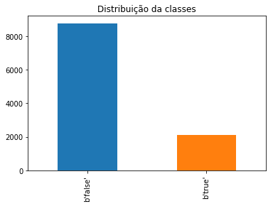
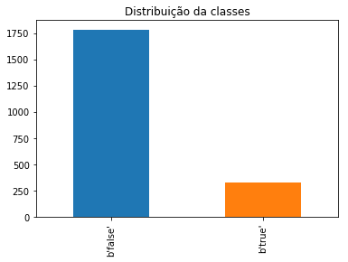
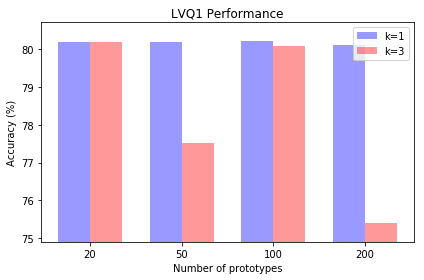
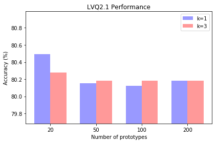
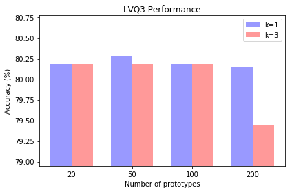
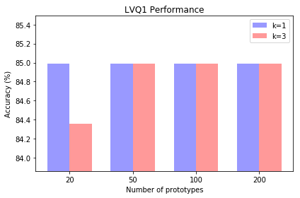
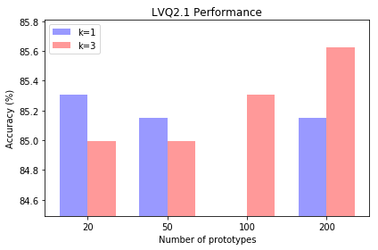
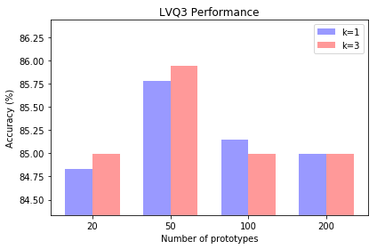

# Aprendizagem de Máquina - Relatório 2
## Aluno: Ítalo Rodrigo Barbosa Paulino (irbp@cin.ufpe.br)

## Questão 1

### Objetivos


<div style="text-align: justify"> Nesta questão, o objetivo é desenvolver um algoritmo que implemente o LVQ1, LVQ2.1 e LVQ3 para geração de protótipos. Logo após, o classificador k-NN (${k=\{1,3\}}$) junto com duas bases de dados do Promise serão utilizados para avaliar a implementação dos algoritmos, onde será mostrado o comportamento para diferentes conjuntos de protótipos.

### Metodologia

<div style="text-align: justify"> Para a avaliação dos algoritmos propostos pela questão, foram utilizados duas bases de dados obtidas no Promise Repository (http://promise.site.uottawa.ca/SERepository/datasets-page.html). O primeiro deles foi o "JM1/Software defect prediction" e o segundo foi o "KC1/Software defect prediction". As duas bases de dados estavam contidas cada uma em um arquivo ARFF (Atribute-Relation File Format), onde cada linha representa uma instância e as colunas representam os atributos juntamente com as classes. Para a leitura deste formato de arquivo foi utilizado o método arff da biblioteca Scipy para Python assim como a biblioteca Pandas que é voltada para a análise de dados. A biblioteca Matplotlib também foi utilizada para gerar os gráficos utilizados na análise. Na base de dados "JM1/Software defect prediction" foi detectado que para algumas instâncias havia atributos ausentes, desta forma um tratamento prévio dos dados foi feito.


```python
from lvq import *
from scipy.io import arff
from sklearn.neighbors import KNeighborsClassifier
import numpy as np
import pandas as pd
from math import isnan
import matplotlib.pyplot as plt
```

<div style="text-align: justify"> Abaixo segue um resumo da base de dados "JM1/Software defect prediction"


```python
data_1 = arff.loadarff('datasets/jm1.arff')
df_1 = pd.DataFrame(data_1[0])
data_1 = df_1.values
df_1.head()
```


<div>
<style scoped>
    .dataframe tbody tr th:only-of-type {
        vertical-align: middle;
    }

    .dataframe tbody tr th {
        vertical-align: top;
    }

    .dataframe thead th {
        text-align: right;
    }
</style>
<table border="1" class="dataframe">
  <thead>
    <tr style="text-align: right;">
      <th></th>
      <th>loc</th>
      <th>v(g)</th>
      <th>ev(g)</th>
      <th>iv(g)</th>
      <th>n</th>
      <th>v</th>
      <th>l</th>
      <th>d</th>
      <th>i</th>
      <th>e</th>
      <th>...</th>
      <th>lOCode</th>
      <th>lOComment</th>
      <th>lOBlank</th>
      <th>locCodeAndComment</th>
      <th>uniq_Op</th>
      <th>uniq_Opnd</th>
      <th>total_Op</th>
      <th>total_Opnd</th>
      <th>branchCount</th>
      <th>defects</th>
    </tr>
  </thead>
  <tbody>
    <tr>
      <th>0</th>
      <td>1.1</td>
      <td>1.4</td>
      <td>1.4</td>
      <td>1.4</td>
      <td>1.3</td>
      <td>1.30</td>
      <td>1.30</td>
      <td>1.30</td>
      <td>1.30</td>
      <td>1.30</td>
      <td>...</td>
      <td>2.0</td>
      <td>2.0</td>
      <td>2.0</td>
      <td>2.0</td>
      <td>1.2</td>
      <td>1.2</td>
      <td>1.2</td>
      <td>1.2</td>
      <td>1.4</td>
      <td>b'false'</td>
    </tr>
    <tr>
      <th>1</th>
      <td>1.0</td>
      <td>1.0</td>
      <td>1.0</td>
      <td>1.0</td>
      <td>1.0</td>
      <td>1.00</td>
      <td>1.00</td>
      <td>1.00</td>
      <td>1.00</td>
      <td>1.00</td>
      <td>...</td>
      <td>1.0</td>
      <td>1.0</td>
      <td>1.0</td>
      <td>1.0</td>
      <td>1.0</td>
      <td>1.0</td>
      <td>1.0</td>
      <td>1.0</td>
      <td>1.0</td>
      <td>b'true'</td>
    </tr>
    <tr>
      <th>2</th>
      <td>72.0</td>
      <td>7.0</td>
      <td>1.0</td>
      <td>6.0</td>
      <td>198.0</td>
      <td>1134.13</td>
      <td>0.05</td>
      <td>20.31</td>
      <td>55.85</td>
      <td>23029.10</td>
      <td>...</td>
      <td>51.0</td>
      <td>10.0</td>
      <td>8.0</td>
      <td>1.0</td>
      <td>17.0</td>
      <td>36.0</td>
      <td>112.0</td>
      <td>86.0</td>
      <td>13.0</td>
      <td>b'true'</td>
    </tr>
    <tr>
      <th>3</th>
      <td>190.0</td>
      <td>3.0</td>
      <td>1.0</td>
      <td>3.0</td>
      <td>600.0</td>
      <td>4348.76</td>
      <td>0.06</td>
      <td>17.06</td>
      <td>254.87</td>
      <td>74202.67</td>
      <td>...</td>
      <td>129.0</td>
      <td>29.0</td>
      <td>28.0</td>
      <td>2.0</td>
      <td>17.0</td>
      <td>135.0</td>
      <td>329.0</td>
      <td>271.0</td>
      <td>5.0</td>
      <td>b'true'</td>
    </tr>
    <tr>
      <th>4</th>
      <td>37.0</td>
      <td>4.0</td>
      <td>1.0</td>
      <td>4.0</td>
      <td>126.0</td>
      <td>599.12</td>
      <td>0.06</td>
      <td>17.19</td>
      <td>34.86</td>
      <td>10297.30</td>
      <td>...</td>
      <td>28.0</td>
      <td>1.0</td>
      <td>6.0</td>
      <td>0.0</td>
      <td>11.0</td>
      <td>16.0</td>
      <td>76.0</td>
      <td>50.0</td>
      <td>7.0</td>
      <td>b'true'</td>
    </tr>
  </tbody>
</table>
<p>5 rows × 22 columns</p>
</div>


```python
df_1.describe()
```


<div>
<style scoped>
    .dataframe tbody tr th:only-of-type {
        vertical-align: middle;
    }

    .dataframe tbody tr th {
        vertical-align: top;
    }

    .dataframe thead th {
        text-align: right;
    }
</style>
<table border="1" class="dataframe">
  <thead>
    <tr style="text-align: right;">
      <th></th>
      <th>loc</th>
      <th>v(g)</th>
      <th>ev(g)</th>
      <th>iv(g)</th>
      <th>n</th>
      <th>v</th>
      <th>l</th>
      <th>d</th>
      <th>i</th>
      <th>e</th>
      <th>...</th>
      <th>t</th>
      <th>lOCode</th>
      <th>lOComment</th>
      <th>lOBlank</th>
      <th>locCodeAndComment</th>
      <th>uniq_Op</th>
      <th>uniq_Opnd</th>
      <th>total_Op</th>
      <th>total_Opnd</th>
      <th>branchCount</th>
    </tr>
  </thead>
  <tbody>
    <tr>
      <th>count</th>
      <td>10880.000000</td>
      <td>10880.000000</td>
      <td>10880.000000</td>
      <td>10880.000000</td>
      <td>10880.000000</td>
      <td>10880.000000</td>
      <td>10880.000000</td>
      <td>10880.000000</td>
      <td>10880.00000</td>
      <td>1.088000e+04</td>
      <td>...</td>
      <td>1.088000e+04</td>
      <td>10880.000000</td>
      <td>10880.000000</td>
      <td>10880.000000</td>
      <td>10880.000000</td>
      <td>10880.000000</td>
      <td>10880.000000</td>
      <td>10880.000000</td>
      <td>10880.000000</td>
      <td>10880.000000</td>
    </tr>
    <tr>
      <th>mean</th>
      <td>42.020138</td>
      <td>6.347739</td>
      <td>3.400037</td>
      <td>4.001415</td>
      <td>114.391388</td>
      <td>673.772003</td>
      <td>0.135352</td>
      <td>14.177339</td>
      <td>29.43885</td>
      <td>3.684563e+04</td>
      <td>...</td>
      <td>2.046980e+03</td>
      <td>26.253125</td>
      <td>2.738787</td>
      <td>4.625092</td>
      <td>0.370956</td>
      <td>11.177592</td>
      <td>16.751857</td>
      <td>68.110588</td>
      <td>46.388989</td>
      <td>11.292316</td>
    </tr>
    <tr>
      <th>std</th>
      <td>76.608641</td>
      <td>13.021924</td>
      <td>6.772697</td>
      <td>9.118682</td>
      <td>249.549291</td>
      <td>1939.253379</td>
      <td>0.160552</td>
      <td>18.712325</td>
      <td>34.42332</td>
      <td>4.344671e+05</td>
      <td>...</td>
      <td>2.413706e+04</td>
      <td>59.622819</td>
      <td>9.010486</td>
      <td>9.969914</td>
      <td>1.908391</td>
      <td>10.045255</td>
      <td>26.667883</td>
      <td>151.513836</td>
      <td>100.351845</td>
      <td>22.597617</td>
    </tr>
    <tr>
      <th>min</th>
      <td>1.000000</td>
      <td>1.000000</td>
      <td>1.000000</td>
      <td>1.000000</td>
      <td>0.000000</td>
      <td>0.000000</td>
      <td>0.000000</td>
      <td>0.000000</td>
      <td>0.00000</td>
      <td>0.000000e+00</td>
      <td>...</td>
      <td>0.000000e+00</td>
      <td>0.000000</td>
      <td>0.000000</td>
      <td>0.000000</td>
      <td>0.000000</td>
      <td>0.000000</td>
      <td>0.000000</td>
      <td>0.000000</td>
      <td>0.000000</td>
      <td>1.000000</td>
    </tr>
    <tr>
      <th>25%</th>
      <td>11.000000</td>
      <td>2.000000</td>
      <td>1.000000</td>
      <td>1.000000</td>
      <td>14.000000</td>
      <td>48.430000</td>
      <td>0.030000</td>
      <td>3.000000</td>
      <td>11.86000</td>
      <td>1.619400e+02</td>
      <td>...</td>
      <td>9.000000e+00</td>
      <td>4.000000</td>
      <td>0.000000</td>
      <td>0.000000</td>
      <td>0.000000</td>
      <td>5.000000</td>
      <td>4.000000</td>
      <td>8.000000</td>
      <td>6.000000</td>
      <td>3.000000</td>
    </tr>
    <tr>
      <th>50%</th>
      <td>23.000000</td>
      <td>3.000000</td>
      <td>1.000000</td>
      <td>2.000000</td>
      <td>49.000000</td>
      <td>217.130000</td>
      <td>0.080000</td>
      <td>9.090000</td>
      <td>21.92500</td>
      <td>2.031020e+03</td>
      <td>...</td>
      <td>1.128300e+02</td>
      <td>13.000000</td>
      <td>0.000000</td>
      <td>2.000000</td>
      <td>0.000000</td>
      <td>11.000000</td>
      <td>11.000000</td>
      <td>29.000000</td>
      <td>19.000000</td>
      <td>5.000000</td>
    </tr>
    <tr>
      <th>75%</th>
      <td>46.000000</td>
      <td>7.000000</td>
      <td>3.000000</td>
      <td>4.000000</td>
      <td>119.000000</td>
      <td>620.850000</td>
      <td>0.160000</td>
      <td>18.902500</td>
      <td>36.78000</td>
      <td>1.141614e+04</td>
      <td>...</td>
      <td>6.342350e+02</td>
      <td>28.000000</td>
      <td>2.000000</td>
      <td>5.000000</td>
      <td>0.000000</td>
      <td>16.000000</td>
      <td>21.000000</td>
      <td>71.000000</td>
      <td>48.000000</td>
      <td>13.000000</td>
    </tr>
    <tr>
      <th>max</th>
      <td>3442.000000</td>
      <td>470.000000</td>
      <td>165.000000</td>
      <td>402.000000</td>
      <td>8441.000000</td>
      <td>80843.080000</td>
      <td>1.300000</td>
      <td>418.200000</td>
      <td>569.78000</td>
      <td>3.107978e+07</td>
      <td>...</td>
      <td>1.726655e+06</td>
      <td>2824.000000</td>
      <td>344.000000</td>
      <td>447.000000</td>
      <td>108.000000</td>
      <td>411.000000</td>
      <td>1026.000000</td>
      <td>5420.000000</td>
      <td>3021.000000</td>
      <td>826.000000</td>
    </tr>
  </tbody>
</table>
<p>8 rows × 21 columns</p>
</div>


<div style="text-align: justify"> Um desbalanceamento entre as classes é notado no gráfico abaixo:


```python
plot_1 = df_1['defects'].value_counts().plot(kind='bar', title='Distribuição da classes')
```





<div style="text-align: justify"> Agora analisando a base de dados "KC1/Software defect prediction", temos:


```python
data_2 = arff.loadarff('datasets/kc1.arff')
df_2 = pd.DataFrame(data_2[0])
data_2 = df_2.values
df_2.head()
```


<div>
<style scoped>
    .dataframe tbody tr th:only-of-type {
        vertical-align: middle;
    }

    .dataframe tbody tr th {
        vertical-align: top;
    }

    .dataframe thead th {
        text-align: right;
    }
</style>
<table border="1" class="dataframe">
  <thead>
    <tr style="text-align: right;">
      <th></th>
      <th>loc</th>
      <th>v(g)</th>
      <th>ev(g)</th>
      <th>iv(g)</th>
      <th>n</th>
      <th>v</th>
      <th>l</th>
      <th>d</th>
      <th>i</th>
      <th>e</th>
      <th>...</th>
      <th>lOCode</th>
      <th>lOComment</th>
      <th>lOBlank</th>
      <th>locCodeAndComment</th>
      <th>uniq_Op</th>
      <th>uniq_Opnd</th>
      <th>total_Op</th>
      <th>total_Opnd</th>
      <th>branchCount</th>
      <th>defects</th>
    </tr>
  </thead>
  <tbody>
    <tr>
      <th>0</th>
      <td>1.1</td>
      <td>1.4</td>
      <td>1.4</td>
      <td>1.4</td>
      <td>1.3</td>
      <td>1.30</td>
      <td>1.30</td>
      <td>1.30</td>
      <td>1.30</td>
      <td>1.30</td>
      <td>...</td>
      <td>2.0</td>
      <td>2.0</td>
      <td>2.0</td>
      <td>2.0</td>
      <td>1.2</td>
      <td>1.2</td>
      <td>1.2</td>
      <td>1.2</td>
      <td>1.4</td>
      <td>b'false'</td>
    </tr>
    <tr>
      <th>1</th>
      <td>1.0</td>
      <td>1.0</td>
      <td>1.0</td>
      <td>1.0</td>
      <td>1.0</td>
      <td>1.00</td>
      <td>1.00</td>
      <td>1.00</td>
      <td>1.00</td>
      <td>1.00</td>
      <td>...</td>
      <td>1.0</td>
      <td>1.0</td>
      <td>1.0</td>
      <td>1.0</td>
      <td>1.0</td>
      <td>1.0</td>
      <td>1.0</td>
      <td>1.0</td>
      <td>1.0</td>
      <td>b'true'</td>
    </tr>
    <tr>
      <th>2</th>
      <td>83.0</td>
      <td>11.0</td>
      <td>1.0</td>
      <td>11.0</td>
      <td>171.0</td>
      <td>927.89</td>
      <td>0.04</td>
      <td>23.04</td>
      <td>40.27</td>
      <td>21378.61</td>
      <td>...</td>
      <td>65.0</td>
      <td>10.0</td>
      <td>6.0</td>
      <td>0.0</td>
      <td>18.0</td>
      <td>25.0</td>
      <td>107.0</td>
      <td>64.0</td>
      <td>21.0</td>
      <td>b'true'</td>
    </tr>
    <tr>
      <th>3</th>
      <td>46.0</td>
      <td>8.0</td>
      <td>6.0</td>
      <td>8.0</td>
      <td>141.0</td>
      <td>769.78</td>
      <td>0.07</td>
      <td>14.86</td>
      <td>51.81</td>
      <td>11436.73</td>
      <td>...</td>
      <td>37.0</td>
      <td>2.0</td>
      <td>5.0</td>
      <td>0.0</td>
      <td>16.0</td>
      <td>28.0</td>
      <td>89.0</td>
      <td>52.0</td>
      <td>15.0</td>
      <td>b'true'</td>
    </tr>
    <tr>
      <th>4</th>
      <td>25.0</td>
      <td>3.0</td>
      <td>1.0</td>
      <td>3.0</td>
      <td>58.0</td>
      <td>254.75</td>
      <td>0.11</td>
      <td>9.35</td>
      <td>27.25</td>
      <td>2381.95</td>
      <td>...</td>
      <td>21.0</td>
      <td>0.0</td>
      <td>2.0</td>
      <td>0.0</td>
      <td>11.0</td>
      <td>10.0</td>
      <td>41.0</td>
      <td>17.0</td>
      <td>5.0</td>
      <td>b'true'</td>
    </tr>
  </tbody>
</table>
<p>5 rows × 22 columns</p>
</div>


```python
df_2.describe()
```


<div>
<style scoped>
    .dataframe tbody tr th:only-of-type {
        vertical-align: middle;
    }

    .dataframe tbody tr th {
        vertical-align: top;
    }

    .dataframe thead th {
        text-align: right;
    }
</style>
<table border="1" class="dataframe">
  <thead>
    <tr style="text-align: right;">
      <th></th>
      <th>loc</th>
      <th>v(g)</th>
      <th>ev(g)</th>
      <th>iv(g)</th>
      <th>n</th>
      <th>v</th>
      <th>l</th>
      <th>d</th>
      <th>i</th>
      <th>e</th>
      <th>...</th>
      <th>t</th>
      <th>lOCode</th>
      <th>lOComment</th>
      <th>lOBlank</th>
      <th>locCodeAndComment</th>
      <th>uniq_Op</th>
      <th>uniq_Opnd</th>
      <th>total_Op</th>
      <th>total_Opnd</th>
      <th>branchCount</th>
    </tr>
  </thead>
  <tbody>
    <tr>
      <th>count</th>
      <td>2109.000000</td>
      <td>2109.000000</td>
      <td>2109.000000</td>
      <td>2109.000000</td>
      <td>2109.000000</td>
      <td>2109.000000</td>
      <td>2109.000000</td>
      <td>2109.000000</td>
      <td>2109.000000</td>
      <td>2109.000000</td>
      <td>...</td>
      <td>2109.00000</td>
      <td>2109.000000</td>
      <td>2109.000000</td>
      <td>2109.000000</td>
      <td>2109.000000</td>
      <td>2109.000000</td>
      <td>2109.000000</td>
      <td>2109.000000</td>
      <td>2109.000000</td>
      <td>2109.000000</td>
    </tr>
    <tr>
      <th>mean</th>
      <td>20.372262</td>
      <td>2.838028</td>
      <td>1.674443</td>
      <td>2.546420</td>
      <td>49.829445</td>
      <td>258.696719</td>
      <td>0.319583</td>
      <td>6.771242</td>
      <td>21.240071</td>
      <td>5242.386240</td>
      <td>...</td>
      <td>291.24504</td>
      <td>14.525367</td>
      <td>0.945946</td>
      <td>1.759602</td>
      <td>0.132764</td>
      <td>7.631674</td>
      <td>9.537316</td>
      <td>31.043717</td>
      <td>18.786724</td>
      <td>4.665908</td>
    </tr>
    <tr>
      <th>std</th>
      <td>29.754442</td>
      <td>3.900763</td>
      <td>2.200659</td>
      <td>3.375859</td>
      <td>83.599874</td>
      <td>516.317605</td>
      <td>0.317029</td>
      <td>7.863646</td>
      <td>21.500367</td>
      <td>17444.981211</td>
      <td>...</td>
      <td>969.16516</td>
      <td>24.188302</td>
      <td>3.085271</td>
      <td>3.856850</td>
      <td>0.704023</td>
      <td>5.730347</td>
      <td>12.195727</td>
      <td>51.776056</td>
      <td>32.074398</td>
      <td>7.792206</td>
    </tr>
    <tr>
      <th>min</th>
      <td>1.000000</td>
      <td>1.000000</td>
      <td>1.000000</td>
      <td>1.000000</td>
      <td>0.000000</td>
      <td>0.000000</td>
      <td>0.000000</td>
      <td>0.000000</td>
      <td>0.000000</td>
      <td>0.000000</td>
      <td>...</td>
      <td>0.00000</td>
      <td>0.000000</td>
      <td>0.000000</td>
      <td>0.000000</td>
      <td>0.000000</td>
      <td>0.000000</td>
      <td>0.000000</td>
      <td>0.000000</td>
      <td>0.000000</td>
      <td>1.000000</td>
    </tr>
    <tr>
      <th>25%</th>
      <td>3.000000</td>
      <td>1.000000</td>
      <td>1.000000</td>
      <td>1.000000</td>
      <td>4.000000</td>
      <td>8.000000</td>
      <td>0.080000</td>
      <td>1.500000</td>
      <td>5.330000</td>
      <td>12.000000</td>
      <td>...</td>
      <td>0.67000</td>
      <td>0.000000</td>
      <td>0.000000</td>
      <td>0.000000</td>
      <td>0.000000</td>
      <td>3.000000</td>
      <td>1.000000</td>
      <td>3.000000</td>
      <td>1.000000</td>
      <td>1.000000</td>
    </tr>
    <tr>
      <th>50%</th>
      <td>9.000000</td>
      <td>1.000000</td>
      <td>1.000000</td>
      <td>1.000000</td>
      <td>16.000000</td>
      <td>57.060000</td>
      <td>0.200000</td>
      <td>3.500000</td>
      <td>14.400000</td>
      <td>213.970000</td>
      <td>...</td>
      <td>11.89000</td>
      <td>5.000000</td>
      <td>0.000000</td>
      <td>0.000000</td>
      <td>0.000000</td>
      <td>6.000000</td>
      <td>5.000000</td>
      <td>10.000000</td>
      <td>6.000000</td>
      <td>1.000000</td>
    </tr>
    <tr>
      <th>75%</th>
      <td>24.000000</td>
      <td>3.000000</td>
      <td>1.000000</td>
      <td>3.000000</td>
      <td>58.000000</td>
      <td>265.930000</td>
      <td>0.670000</td>
      <td>9.200000</td>
      <td>29.850000</td>
      <td>2276.020000</td>
      <td>...</td>
      <td>126.45000</td>
      <td>17.000000</td>
      <td>0.000000</td>
      <td>2.000000</td>
      <td>0.000000</td>
      <td>11.000000</td>
      <td>13.000000</td>
      <td>36.000000</td>
      <td>22.000000</td>
      <td>5.000000</td>
    </tr>
    <tr>
      <th>max</th>
      <td>288.000000</td>
      <td>45.000000</td>
      <td>26.000000</td>
      <td>45.000000</td>
      <td>1106.000000</td>
      <td>7918.820000</td>
      <td>2.000000</td>
      <td>53.750000</td>
      <td>193.060000</td>
      <td>324803.510000</td>
      <td>...</td>
      <td>18044.64000</td>
      <td>262.000000</td>
      <td>44.000000</td>
      <td>58.000000</td>
      <td>12.000000</td>
      <td>37.000000</td>
      <td>120.000000</td>
      <td>678.000000</td>
      <td>428.000000</td>
      <td>89.000000</td>
    </tr>
  </tbody>
</table>
<p>8 rows × 21 columns</p>
</div>


<div style="text-align: justify"> Assim como a primeira base de dados, podemos observar aqui também uma desproporção entre as classes do problema:


```python
plot_2 = df_2['defects'].value_counts().plot(kind='bar', title='Distribuição da classes')
```





<div style="text-align: justify"> Os algoritmos LVQ1, LVQ2.1 e LVQ3 foram implementados em Python e se econtram no diretório `src/` no arquivo `lvq.py`. Para o k-NN foi utilizado a solução fornecida pela biblitoteca scikit-learn (http://scikit-learn.org/stable/). No LVQ1 foi definido ${\alpha = 0.3}$, no LVQ2.1 ${w = 0.2}$ e no LVQ3 foram definidos ${w = 0.2}$ e ${\epsilon = 0.1}$. $70\%$ do dataset foi separado para o treinamento dos protótipos e logo após o treino $30\%$ restante do dataset foi utilizado como conjunto de teste do k-NN enquanto os protótipos foram utilizados como conjunto de treino. A normalização dos dados também foi aplicada nos datasets utilizados, já que eles apresentavam atributos com valores que variavam mais do que outros, sem a normalização esses atributos teriam "pesos" maiores do que os outros durante o treinamento.

### Resultados

<div style="text-align: justify"> Para a avaliação dos algorimos LVQ1, LVQ2.1 e LVQ3 cada base de dados foi submetida ao treino e depois os protótipos gerados foram submetidos ao k-NN para os números de vizinhos ${k = \{1, 3\}}$. O número de protótipos gerados também foi variado entre os testes. As acurácias obtidas com as bases de dados seguem abaixo:

#### JM1/Software defect prediction


```python
print("-----------------------Dataset: JM1/Software defect prediction-----------------------")

df_1['defects'] = pd.factorize(df_1['defects'])[0] + 1
df_norm_1 = (df_1.iloc[:,:-1] - df_1.iloc[:,:-1].mean()) / (df_1.iloc[:,:-1].max() - df_1.iloc[:,:-1].min())
df_norm_1['defects'] = df_1['defects']
data_1 = df_norm_1.values
np.random.shuffle(data_1)
n_rows_data1 = len(data_1)
n_train1 = int(n_rows_data1 * 0.7)
train_1 = data_1[:n_train1]
test_1 = data_1[n_train1:]
```

    -----------------------Dataset: JM1/Software defect prediction-----------------------


```python
n_prototypes = [20, 50, 100, 200]
acc_1_k1 = []
acc_1_k3 = []

for n_prot in n_prototypes:
    prototypes_1 = lvq_1(train_1, n_prot, 0.3)

    x_train = np.asarray(prototypes_1)[:,:-1]
    y_train = np.asarray(prototypes_1)[:,-1]
    x_test = np.asarray(test_1[:,:-1])
    y_test = np.asarray(test_1[:,-1])

    knn = KNeighborsClassifier(n_neighbors=1, n_jobs=4)
    knn.fit(x_train, y_train)
    predicts = knn.predict(x_test)
    acc = ((predicts == y_test).sum()/len(predicts))*100
    print("LVQ1 - The accuracy for k = 1 and {:d} prototypes is {:.2f}%".format(n_prot, acc))
    acc_1_k1.append(acc)

    knn = KNeighborsClassifier(n_neighbors=3, n_jobs=4)
    knn.fit(x_train, y_train)
    predicts = knn.predict(x_test)
    acc = ((predicts == y_test).sum()/len(predicts))*100
    print("LVQ1 - The accuracy for k = 3 and {:d} prototypes is: {:.2f}%".format(n_prot, acc))
    acc_1_k3.append(acc)
    
fig1, ax1 = plt.subplots()

index = np.arange(len(n_prototypes))
bar_width = 0.35
opacity = 0.4

rects1 = ax1.bar(index, acc_1_k1, bar_width,
                alpha=opacity, color='b',
                label='k=1')

rects2 = ax1.bar(index + bar_width, acc_1_k3,
                bar_width, color='r',
                alpha=opacity, label='k=3')

max_y = max(max(acc_1_k1, acc_1_k3))
min_y = min(min(acc_1_k1, acc_1_k3))
ax1.set_ylim([min_y-0.5, max_y+0.5])
ax1.set_xlabel('Number of prototypes')
ax1.set_ylabel('Accuracy (%)')
ax1.set_title('LVQ1 Performance')
ax1.set_xticks(index + bar_width / 2)
ax1.set_xticklabels(('20', '50', '100', '200'))
ax1.legend()

fig1.tight_layout()
plt.show()
```

    LVQ1 - The accuracy for k = 1 and 20 prototypes is 80.18%
    LVQ1 - The accuracy for k = 3 and 20 prototypes is: 80.18%
    LVQ1 - The accuracy for k = 1 and 50 prototypes is 80.18%
    LVQ1 - The accuracy for k = 3 and 50 prototypes is: 77.52%
    LVQ1 - The accuracy for k = 1 and 100 prototypes is 80.21%
    LVQ1 - The accuracy for k = 3 and 100 prototypes is: 80.09%
    LVQ1 - The accuracy for k = 1 and 200 prototypes is 80.12%
    LVQ1 - The accuracy for k = 3 and 200 prototypes is: 75.41%





```python
acc_1_k1 = []
acc_1_k3 = []

for n_prot in n_prototypes:
    prototypes_1 = lvq_21(train_1, n_prot, 0.3)

    x_train = np.asarray(prototypes_1)[:,:-1]
    y_train = np.asarray(prototypes_1)[:,-1]
    x_test = np.asarray(test_1[:,:-1])
    y_test = np.asarray(test_1[:,-1])

    knn = KNeighborsClassifier(n_neighbors=1, n_jobs=4)
    knn.fit(x_train, y_train)
    predicts = knn.predict(x_test)
    acc = ((predicts == y_test).sum()/len(predicts))*100
    print("LVQ2.1 - The accuracy for k = 1 and {:d} prototypes is {:.2f}%".format(n_prot, acc))
    acc_1_k1.append(acc)

    knn = KNeighborsClassifier(n_neighbors=3, n_jobs=4)
    knn.fit(x_train, y_train)
    predicts = knn.predict(x_test)
    acc = ((predicts == y_test).sum()/len(predicts))*100
    print("LVQ2.1 - The accuracy for k = 3 and {:d} prototypes is: {:.2f}%".format(n_prot, acc))
    acc_1_k3.append(acc)
    
    
fig2, ax2 = plt.subplots()

index = np.arange(len(n_prototypes))
bar_width = 0.35
opacity = 0.4

rects1 = ax2.bar(index, acc_1_k1, bar_width,
                alpha=opacity, color='b',
                label='k=1')

rects2 = ax2.bar(index + bar_width, acc_1_k3,
                bar_width, color='r',
                alpha=opacity, label='k=3')

max_y = max(max(acc_1_k1, acc_1_k3))
min_y = min(min(acc_1_k1, acc_1_k3))
ax2.set_ylim([min_y-0.5, max_y+0.5])
ax2.set_xlabel('Number of prototypes')
ax2.set_ylabel('Accuracy (%)')
ax2.set_title('LVQ2.1 Performance')
ax2.set_xticks(index + bar_width / 2)
ax2.set_xticklabels(('20', '50', '100', '200'))
ax2.legend()

fig2.tight_layout()
plt.show()
```

    LVQ2.1 - The accuracy for k = 1 and 20 prototypes is 80.49%
    LVQ2.1 - The accuracy for k = 3 and 20 prototypes is: 80.28%
    LVQ2.1 - The accuracy for k = 1 and 50 prototypes is 80.15%
    LVQ2.1 - The accuracy for k = 3 and 50 prototypes is: 80.18%
    LVQ2.1 - The accuracy for k = 1 and 100 prototypes is 80.12%
    LVQ2.1 - The accuracy for k = 3 and 100 prototypes is: 80.18%
    LVQ2.1 - The accuracy for k = 1 and 200 prototypes is 80.18%
    LVQ2.1 - The accuracy for k = 3 and 200 prototypes is: 80.18%





```python
acc_1_k1 = []
acc_1_k3 = []

for n_prot in n_prototypes:
    prototypes_1 = lvq_3(train_1, n_prot, 0.3)

    x_train = np.asarray(prototypes_1)[:,:-1]
    y_train = np.asarray(prototypes_1)[:,-1]
    x_test = np.asarray(test_1[:,:-1])
    y_test = np.asarray(test_1[:,-1])

    knn = KNeighborsClassifier(n_neighbors=1, n_jobs=4)
    knn.fit(x_train, y_train)
    predicts = knn.predict(x_test)
    acc = ((predicts == y_test).sum()/len(predicts))*100
    print("LVQ3 - The accuracy for k = 1 and {:d} prototypes is {:.2f}%".format(n_prot, acc))
    acc_1_k1.append(acc)

    knn = KNeighborsClassifier(n_neighbors=3, n_jobs=4)
    knn.fit(x_train, y_train)
    predicts = knn.predict(x_test)
    acc = ((predicts == y_test).sum()/len(predicts))*100
    print("LVQ3 - The accuracy for k = 3 and {:d} prototypes is: {:.2f}%".format(n_prot, acc))
    acc_1_k3.append(acc)
    
fig3, ax3 = plt.subplots()

index = np.arange(len(n_prototypes))
bar_width = 0.35
opacity = 0.4

rects1 = ax3.bar(index, acc_1_k1, bar_width,
                alpha=opacity, color='b',
                label='k=1')

rects2 = ax3.bar(index + bar_width, acc_1_k3,
                bar_width, color='r',
                alpha=opacity, label='k=3')

max_y = max(max(acc_1_k1, acc_1_k3))
min_y = min(min(acc_1_k1, acc_1_k3))
ax3.set_ylim([min_y-0.5, max_y+0.5])
ax3.set_xlabel('Number of prototypes')
ax3.set_ylabel('Accuracy (%)')
ax3.set_title('LVQ3 Performance')
ax3.set_xticks(index + bar_width / 2)
ax3.set_xticklabels(('20', '50', '100', '200'))
ax3.legend()

fig3.tight_layout()
plt.show()
```

    LVQ3 - The accuracy for k = 1 and 20 prototypes is 80.18%
    LVQ3 - The accuracy for k = 3 and 20 prototypes is: 80.18%
    LVQ3 - The accuracy for k = 1 and 50 prototypes is 80.28%
    LVQ3 - The accuracy for k = 3 and 50 prototypes is: 80.18%
    LVQ3 - The accuracy for k = 1 and 100 prototypes is 80.18%
    LVQ3 - The accuracy for k = 3 and 100 prototypes is: 80.18%
    LVQ3 - The accuracy for k = 1 and 200 prototypes is 80.15%
    LVQ3 - The accuracy for k = 3 and 200 prototypes is: 79.45%





```python
df_2['defects'] = pd.factorize(df_2['defects'])[0] + 1
df_norm_2 = (df_2.iloc[:,:-1] - df_2.iloc[:,:-1].mean()) / (df_2.iloc[:,:-1].max() - df_2.iloc[:,:-1].min())
df_norm_2['defects'] = df_2['defects']
data_2 = df_norm_2.values
np.random.shuffle(data_2)
n_rows_data2 = len(data_2)
n_train2 = int(n_rows_data2 * 0.7)
train_2 = data_2[:n_train2]
test_2 = data_2[n_train2:]
```

#### KC1/Software defect prediction


```python
print("-----------------------Dataset: KC1/Software defect prediction-----------------------")

acc_2_k1 = []
acc_2_k3 = []

for n_prot in n_prototypes:
    prototypes_2 = lvq_1(train_2, n_prot, 0.3)

    x_train = np.asarray(prototypes_2)[:,:-1]
    y_train = np.asarray(prototypes_2)[:,-1]
    x_test = np.asarray(test_2[:,:-1])
    y_test = np.asarray(test_2[:,-1])

    knn = KNeighborsClassifier(n_neighbors=1, n_jobs=4)
    knn.fit(x_train, y_train)
    predicts = knn.predict(x_test)
    acc = ((predicts == y_test).sum()/len(predicts))*100
    print("LVQ1 - The accuracy for k = 1 and {:d} prototypes is {:.2f}%".format(n_prot, acc))
    acc_2_k1.append(acc)

    knn = KNeighborsClassifier(n_neighbors=3, n_jobs=4)
    knn.fit(x_train, y_train)
    predicts = knn.predict(x_test)
    acc = ((predicts == y_test).sum()/len(predicts))*100
    print("LVQ1 - The accuracy for k = 3 and {:d} prototypes is: {:.2f}%".format(n_prot, acc))
    acc_2_k3.append(acc)
    
fig1, ax1 = plt.subplots()

index = np.arange(len(n_prototypes))
bar_width = 0.35
opacity = 0.4

rects1 = ax1.bar(index, acc_2_k1, bar_width,
                alpha=opacity, color='b',
                label='k=1')

rects2 = ax1.bar(index + bar_width, acc_2_k3,
                bar_width, color='r',
                alpha=opacity, label='k=3')

max_y = max(max(acc_2_k1, acc_2_k3))
min_y = min(min(acc_2_k1, acc_2_k3))
ax1.set_ylim([min_y-0.5, max_y+0.5])
ax1.set_xlabel('Number of prototypes')
ax1.set_ylabel('Accuracy (%)')
ax1.set_title('LVQ1 Performance')
ax1.set_xticks(index + bar_width / 2)
ax1.set_xticklabels(('20', '50', '100', '200'))
ax1.legend()

fig1.tight_layout()
plt.show()
```

    -----------------------Dataset: KC1/Software defect prediction-----------------------
    LVQ1 - The accuracy for k = 1 and 20 prototypes is 84.99%
    LVQ1 - The accuracy for k = 3 and 20 prototypes is: 84.36%
    LVQ1 - The accuracy for k = 1 and 50 prototypes is 84.99%
    LVQ1 - The accuracy for k = 3 and 50 prototypes is: 84.99%
    LVQ1 - The accuracy for k = 1 and 100 prototypes is 84.99%
    LVQ1 - The accuracy for k = 3 and 100 prototypes is: 84.99%
    LVQ1 - The accuracy for k = 1 and 200 prototypes is 84.99%
    LVQ1 - The accuracy for k = 3 and 200 prototypes is: 84.99%





```python
acc_2_k1 = []
acc_2_k3 = []

for n_prot in n_prototypes:
    prototypes_2 = lvq_21(train_2, n_prot, 0.3)

    x_train = np.asarray(prototypes_2)[:,:-1]
    y_train = np.asarray(prototypes_2)[:,-1]
    x_test = np.asarray(test_2[:,:-1])
    y_test = np.asarray(test_2[:,-1])

    knn = KNeighborsClassifier(n_neighbors=1, n_jobs=4)
    knn.fit(x_train, y_train)
    predicts = knn.predict(x_test)
    acc = ((predicts == y_test).sum()/len(predicts))*100
    print("LVQ2.1 - The accuracy for k = 1 and {:d} prototypes is {:.2f}%".format(n_prot, acc))
    acc_2_k1.append(acc)

    knn = KNeighborsClassifier(n_neighbors=3, n_jobs=4)
    knn.fit(x_train, y_train)
    predicts = knn.predict(x_test)
    acc = ((predicts == y_test).sum()/len(predicts))*100
    print("LVQ2.1 - The accuracy for k = 3 and {:d} prototypes is: {:.2f}%".format(n_prot, acc))
    acc_2_k3.append(acc)
    
fig2, ax2 = plt.subplots()

index = np.arange(len(n_prototypes))
bar_width = 0.35
opacity = 0.4

rects1 = ax2.bar(index, acc_2_k1, bar_width,
                alpha=opacity, color='b',
                label='k=1')

rects2 = ax2.bar(index + bar_width, acc_2_k3,
                bar_width, color='r',
                alpha=opacity, label='k=3')

max_y = max(max(acc_2_k1, acc_2_k3))
min_y = min(min(acc_2_k1, acc_2_k3))
ax2.set_ylim([min_y-0.5, max_y+0.5])
ax2.set_xlabel('Number of prototypes')
ax2.set_ylabel('Accuracy (%)')
ax2.set_title('LVQ2.1 Performance')
ax2.set_xticks(index + bar_width / 2)
ax2.set_xticklabels(('20', '50', '100', '200'))
ax2.legend()

fig2.tight_layout()
plt.show()
```

    LVQ2.1 - The accuracy for k = 1 and 20 prototypes is 85.31%
    LVQ2.1 - The accuracy for k = 3 and 20 prototypes is: 84.99%
    LVQ2.1 - The accuracy for k = 1 and 50 prototypes is 85.15%
    LVQ2.1 - The accuracy for k = 3 and 50 prototypes is: 84.99%
    LVQ2.1 - The accuracy for k = 1 and 100 prototypes is 84.20%
    LVQ2.1 - The accuracy for k = 3 and 100 prototypes is: 85.31%
    LVQ2.1 - The accuracy for k = 1 and 200 prototypes is 85.15%
    LVQ2.1 - The accuracy for k = 3 and 200 prototypes is: 85.62%





```python
acc_2_k1 = []
acc_2_k3 = []

for n_prot in n_prototypes:
    prototypes_2 = lvq_3(train_2, n_prot, 0.3)

    x_train = np.asarray(prototypes_2)[:,:-1]
    y_train = np.asarray(prototypes_2)[:,-1]
    x_test = np.asarray(test_2[:,:-1])
    y_test = np.asarray(test_2[:,-1])

    knn = KNeighborsClassifier(n_neighbors=1, n_jobs=4)
    knn.fit(x_train, y_train)
    predicts = knn.predict(x_test)
    acc = ((predicts == y_test).sum()/len(predicts))*100
    print("LVQ3 - The accuracy for k = 1 and {:d} prototypes is {:.2f}%".format(n_prot, acc))
    acc_2_k1.append(acc)

    knn = KNeighborsClassifier(n_neighbors=3, n_jobs=4)
    knn.fit(x_train, y_train)
    predicts = knn.predict(x_test)
    acc = ((predicts == y_test).sum()/len(predicts))*100
    print("LVQ3 - The accuracy for k = 3 and {:d} prototypes is: {:.2f}%".format(n_prot, acc))
    acc_2_k3.append(acc)
    
fig3, ax3 = plt.subplots()

index = np.arange(len(n_prototypes))
bar_width = 0.35
opacity = 0.4

rects1 = ax3.bar(index, acc_2_k1, bar_width,
                alpha=opacity, color='b',
                label='k=1')

rects2 = ax3.bar(index + bar_width, acc_2_k3,
                bar_width, color='r',
                alpha=opacity, label='k=3')

max_y = max(max(acc_2_k1, acc_2_k3))
min_y = min(min(acc_2_k1, acc_2_k3))
ax3.set_ylim([min_y-0.5, max_y+0.5])
ax3.set_xlabel('Number of prototypes')
ax3.set_ylabel('Accuracy (%)')
ax3.set_title('LVQ3 Performance')
ax3.set_xticks(index + bar_width / 2)
ax3.set_xticklabels(('20', '50', '100', '200'))
ax3.legend()

fig3.tight_layout()
plt.show()
```

    LVQ3 - The accuracy for k = 1 and 20 prototypes is 84.83%
    LVQ3 - The accuracy for k = 3 and 20 prototypes is: 84.99%
    LVQ3 - The accuracy for k = 1 and 50 prototypes is 85.78%
    LVQ3 - The accuracy for k = 3 and 50 prototypes is: 85.94%
    LVQ3 - The accuracy for k = 1 and 100 prototypes is 85.15%
    LVQ3 - The accuracy for k = 3 and 100 prototypes is: 84.99%
    LVQ3 - The accuracy for k = 1 and 200 prototypes is 84.99%
    LVQ3 - The accuracy for k = 3 and 200 prototypes is: 84.99%





<div style="text-align: justify"> Com os resultados mostrados acima, podemos observar que os resultados entre as três implementações dos LVQ's são bem parecidos e apresentam acurácia em volta dos $80\%$, isso provavelmente se deve ao desbalanceamento da base de dados. No segundo dataset podemos observar também que as acurácias são ligeiramente maiores do que as acurácias obtidas com o primeiro dataset, isso se deve ao fato de que os protótipos gerados pelo segundo dataset representam melhor a base de dados já que esta é menor do que a primeira e foram utilizados o mesmo número de protótipos nos dois.

#### Comparação do k-NN com e sem protótipos

<div style="text-align: justify"> Logo abaixo será feita uma comparação utilizando o k-NN com a utilização de protótipos gerados pelo LVQ3 para um número de protótipos igual a 200 e também sem a utilização de protótipos. A base de dados que será utilizada será a "KC1/Software defect prediction".


```python
print("-----------------------k-NN comparison with and without prototypes-----------------------")

df_2['defects'] = pd.factorize(df_2['defects'])[0] + 1
df_norm_2 = (df_2.iloc[:,:-1] - df_2.iloc[:,:-1].mean()) / (df_2.iloc[:,:-1].max() - df_2.iloc[:,:-1].min())
df_norm_2['defects'] = df_2['defects']
data_2 = df_norm_2.values
np.random.shuffle(data_2)
n_rows_data2 = len(data_2)
n_train2 = int(n_rows_data2 * 0.7)
train_2 = data_2[:n_train2]
test_2 = data_2[n_train2:]

# Obtendo os 200 protótipos utilizando o LVQ3
prototypes = lvq_3(train_2, 200, 0.3)

# Conjunto de treino formado pelos prototipos
x_train = np.asarray(prototypes)[:,:-1]
y_train = np.asarray(prototypes)[:,-1]

# Conjunto de treino formado por 70% do dataset original
x_train_d = np.asarray(train_2)[:,:-1]
y_train_d = np.asarray(train_2)[:,-1]

# Conjunto de treino que vai ser utilizado no k-NN
x_test = np.asarray(test_2[:,:-1])
y_test = np.asarray(test_2[:,-1])

# Executando o 1-NN usando como conjunto de treino os prototipos
knn_1 = KNeighborsClassifier(n_neighbors=1, n_jobs=4)
knn_1.fit(x_train, y_train)
predicts = knn_1.predict(x_test)
acc = ((predicts == y_test).sum()/len(predicts))*100
print("The accuracy for k = 1 and 200 prototypes is: {:.2f}%".format(acc))
# Executando o 1-NN usando como conjunto de treino o dataset original
knn_1.fit(x_train_d, y_train_d)
predicts = knn_1.predict(x_test)
acc = ((predicts == y_test).sum()/len(predicts))*100
print("The accuracy for k = 1 without prototypes is: {:.2f}%".format(acc))
# Executando o 3-NN usando como conjunto de treino os prototipos
knn_3 = KNeighborsClassifier(n_neighbors=3, n_jobs=4)
knn_3.fit(x_train, y_train)
predicts = knn_3.predict(x_test)
acc = ((predicts == y_test).sum()/len(predicts))*100
print("The accuracy for k = 3 and 200 prototypes is: {:.2f}%".format(acc))
# Executando o 3-NN usando como conjunto de treino o dataset original
knn_3.fit(x_train_d, y_train_d)
predicts = knn_3.predict(x_test)
acc = ((predicts == y_test).sum()/len(predicts))*100
print("The accuracy for k = 3 without prototypes is: {:.2f}%".format(acc))
```

    -----------------------k-NN comparison with and without prototypes-----------------------
    The accuracy for k = 1 and 200 prototypes is: 83.57%
    The accuracy for k = 1 without prototypes is: 83.10%
    The accuracy for k = 3 and 200 prototypes is: 83.41%
    The accuracy for k = 3 without prototypes is: 85.15%


### Conclusão

<div style="text-align: justify"> Com a implementação dos algoritmos sugeridos pela atividade, pode-se notar que a geração de protótipos algo é interessante a se fazer quando se quer reduzir a base de dados para um tamanho mais viável. Através das avaliações executadas foram obtidas acurácias com valores bastante próximos tanto para os testes com protótipos quanto para o teste sem protótipos, ainda assim a acurácia ainda permaneceu abaixo de $90\%$ provavelmente por conta do desbalanceamento das classes da base de dados.
